# Lab2 - Your first window

In this lab, we will discover event-driven programming by creating a first interactive window for a Quiz application.

## Work to hand in

At the end of the two sessions (a total of 4 hours' work), you'll have to submit your project using **travo**.

## The topic

IUT Television is a hit on Twitch with their latest Quiz show. They want to take advantage of this to launch a mobile application to accumulate even more followers, but first they want to make a prototype in WPF to check how this application could work.

So they asked IUT students to create the prototype.

Their design team produced the following mock-up:

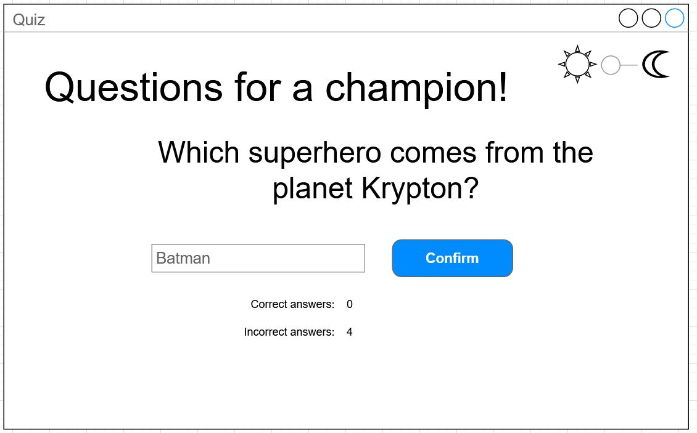

The expected functionalities are:
- Switch from Night to Day mode (controls at top right)
- Display a question and allow the user to enter an answer.
- Display the number of correct answers, as well as the number of incorrect answers.
- Once the user has entered an answer, **a MessageBox** tells them whether it is correct or incorrect (also gives them the correct answer in this case), then another question is displayed.
- Propose at least ten different questions.

Additional features include:
- Play a different sound when the answer is correct or incorrect. 

## (1) Retrieve the project using **travo**.
<details>
  <summary>See instructions here to retrieve and submit the project (important).</summary> 

> To retrieve the project and submit it at the end of the two sessions, you'll need to use the **travo** script provided by the teacher responsable for this course. Download this script [**travoIHM.py**](https://ihm.gitpages.iut-orsay.fr/cours/travoIHM.py) to your personal space (somewhere in drive Z:).
> 
> **travo** is a set of Python scripts maintained by teachers & researchers from Paris-Saclay and Quebec, making it easier for teachers to use GIT. In fact, **travo** commands perform a set of GIT commands for you. Both **travo** and Python are already installed on IUT computers.
> > 
> > You can use your own computer and install **travo** on it (provided you've installed Python beforehand, of course) using the command
> > ```
> > pip install travo
> > ```
> 
> On the IUT computer, go to the C:WinPython directory and run the "WinPython Powershell Prompt.exe" program. A Powershell terminal will open, ready to receive Python commands.
> Inside this PowerShell terminal, first type the following command, enabling you to move to > your personal space:
> 
> ```
> cd Z:\
> ```
> 
> If you type the **ls** command, you should see the **travoIHM.py** script you downloaded earlier in the list of files in this directory (of course, you can work in a directory other than the root of the Z: directory).
> 
> Finally, to retrieve the project, simply type the command :
> 
> ```
> python travoIHM.py fetch tpihm2
> ```
> 
> You will be asked for your ADONIS (IUT) login information, and the project will be downloaded to your computer (in the "tpihm2" directory). If an authentication window opens after you've already entered your information in the Powershell terminal, you can close it.
> 
> Save or submit your work to your teacher with the command : 
> ```
> python travoIHM.py submit tpihm2 ####
> ```
> You need to replace #### with your group ID **tp2a** or **tp2b** etc... Don't enter the wrong group, you'll lose points (if you've made a mistake, you can resubmit with the correct group and travo will correct the error, so don't panic).
> 
> You can submit as many times as you like. It's good practice not to lose your work.

</details>

## Visual Studio Project, .Net, WPF and C#
<details>
  <summary>See here what a WPF.Net project is. </summary> 

> ### Visual Studio
> 
> In this HMI course, we'll be using Microsoft's **Visual Studio Community** development environment (not to be confused with **Visual Studio Code**, which is very popular and very cool, but doesn't have the features we need here) and the **WPF** (Windows Presentation Foundation) graphic component libraries of the **.Net** Framework.
> 
> ### .Net
> 
> The .Net framework is a software environment developed by Microsoft and available since the latest releases on the main OS (depending on version): Windows, MacOS and Linux. 
> 
> In a similar way to the Java virtual machine, the .Net framework aims to abstract the machine's rather low-level operating layer by using an intermediary between the code written by the programmer and the machine.
> 
> In your first courses, you learned how to compile code (in C or C++) into machine language (a binary executable that the machine understands and can execute directly). 
> 
> In a .Net application, the code (C#, VB.Net or even C++) is first converted by a compiler into an intermediate language (CIL) and not into machine language (so the machine can't execute it right away). 
> At runtime, it's actually .Net's Common Language Runtime CLR (which works a bit like a Java virtual machine, an intermediary) that takes this intermediate language and compiles it on the fly into machine language (Just-In-Time compilation) to trigger and control its execution.
> 
> This "virtual machine" enables you to observe and act on the code as it runs (debugging, memory management, introspection, etc.), whereas a standard application is much more rigid and less flexible once compiled.
> 
> ### XAML and C#
> 
> In order to program applications in WPF, we need two languages:
> - XAML, which is an XML format (like HTML is an XML format) that will be used to describe our application's graphical interface (where the buttons are, the texts, the size of the window, etc.).
> - C#, one of the TOP5 languages in the TIOBE ranking, which we'll use to build the functional part of the application.
> 
> Traditional frameworks for graphical applications (such as Java Swing, C# Winforms, Python Tkinter or C++ QT) generally use a single language. 
> 
> Each approach has its advantages and disadvantages, but this way of working with two languages is inspired by the web (HTML for the interface, Javascript for the executable code) and will enable us to introduce the concepts more calmly.
> 

</details>

## (2) A Visual Studio Solution .sln

In the world of Visual Studio, all the files in a project are grouped together in what is known as a **solution**. The description of the solution is saved as a **.sln** file. 

You could perfectly well create a new "WPF C# Application" project in Visual Studio, which would create a new solution for you, but we've prepared an empty solution for you to work in.

Go to the **tpihm2** directory you retrieved with **travo** and double-click on the **.sln** file. Visual Studio should open your project/solution. By default, a WPF project is made up of a set of files which may seem a little obscure. We don't need to understand them all just yet; in this lab we'll focus on the files that interest us.

The two things I'd like to draw your attention to are:
- Don't immediately look for a Main() function (as in Java and C++). It exists (if you search all the files, you'll eventually find it) but normally we don't need to modify it.
- The presence of the MainWindow.xaml and MainWindow.xaml.cs files, which will enable us to create the window and its behavior.

Normally, the Designer view should open and show you an empty window. If this isn't the case, use the Solution Explorer on the right to find the MainWindow.xaml file and double-click to open it.

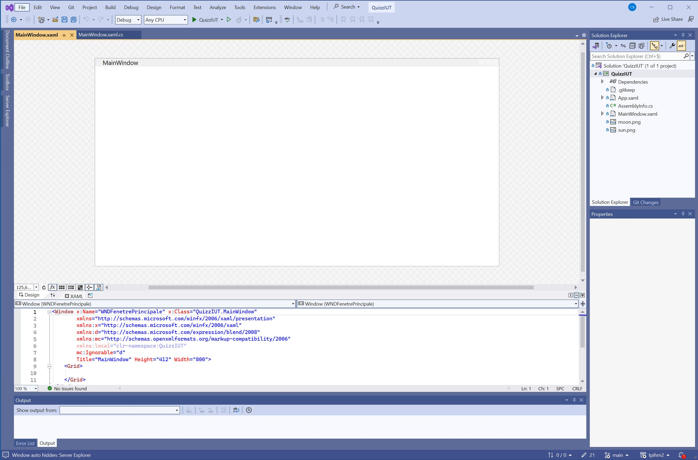

**You need to change a parameter to switch to English**: In the TOOLS menu at the top of the window (Outils), select "Options", then "Environment", then "International Settings", and English. Remember to switch to English for EACH class as the setting may be switched back to French by other students :tired_face: Use this setting on your personal computer as well. If you do not have an English option, go to this webpage to learn how to install the necessary linguistic package: https://learn.microsoft.com/en-us/visualstudio/install/modify-visual-studio?view=vs-2022

### A word about C# and its partial classes

The way in which the code of a program is organized differs slightly between C++, Java and C#. In Java, for example, it is not possible to write the code of a class in two files; the code of a class must be gathered in a single file.

In C#, this is made possible by the use of the "partial" keyword in front of a class name. Thanks to this keyword, you can define the code of a class in each file containing the class name preceded by the word "partial".

More on this later...

## (3) Introduction to the development environment

The Visual Studio interface is broken down into different views that can be moved, added, deleted...

By default, you should have a layout similar to this one:

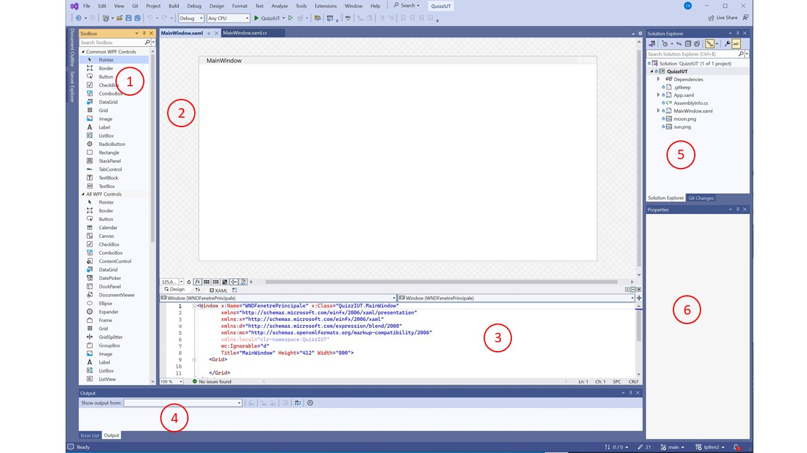

- 1. The toolbox, which contains the list of controls you can add to your application. This view may be folded to the far left. You can leave it visible by clicking on the pin when it's unfolded.

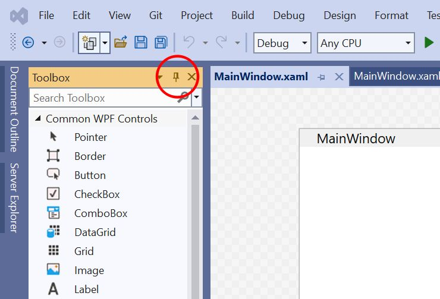

- 2. the Designer view, which lets you directly manipulate the controls you've added (change their size and position), as well as the window.

- 3. the XAML view, which lets you edit the XAML code that describes the content of your application. The Designer view is a visual representation of the XAML code that describes our application's graphical interface. You can see the real XAML content in the XAML view, just below the Designer view. These two views are synchronized. A change in the XAML view is seen in the Designer view, and a change in the Designer view is immediately reflected in the XAML view. For the moment, our XAML contains only a Window, which in turn contains a Grid. You'll find here the principle of an XML tree structure similar to that of HTML. More information is available in the Microsoft documentation (https://learn.microsoft.com/en-us/visualstudio/xaml-tools/xaml-code-editor?view=vs-2022)

- 4. The Output view, which will display messages from the compiler if you have an error in your code, and will also display messages written in the console during program execution.

- 5. The Solution Explorer view, which lists all project/solution files.

- 6. The Properties view, one of the most important and yet somewhat discreet views. When an element is selected in the Designer or XAML view, the Property view shows all the attributes of this element that can be modified. This is where you can change the size, color and name of each element. All these properties can also be edited directly from the XAML code.

## (4) Statements

Start by adding a Label to your window by dragging it from the Toolbox to the Designer view (you understand that you could also add it by writing its code directly in the XAML file).


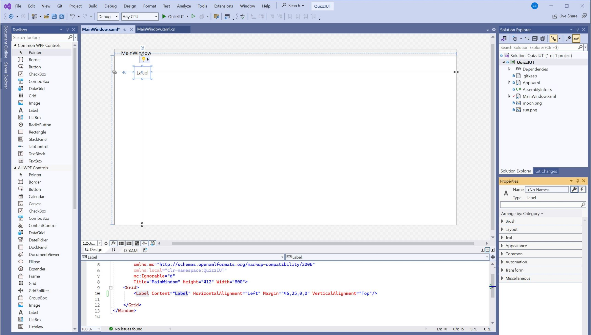

[-Important: each time you add an element to the GUI, I'll ask you to change its "Name" property according to the following convention: First three uppercase letters describing the type of control, followed by an explicit word.-]

Change this control's "Name" property to "LBLTitle".

Also change the "Name" of the window to "WNDMainWindow".

Change its properties (it's up to you to find out which ones) so that it displays the phrase "Questions for a champion!".

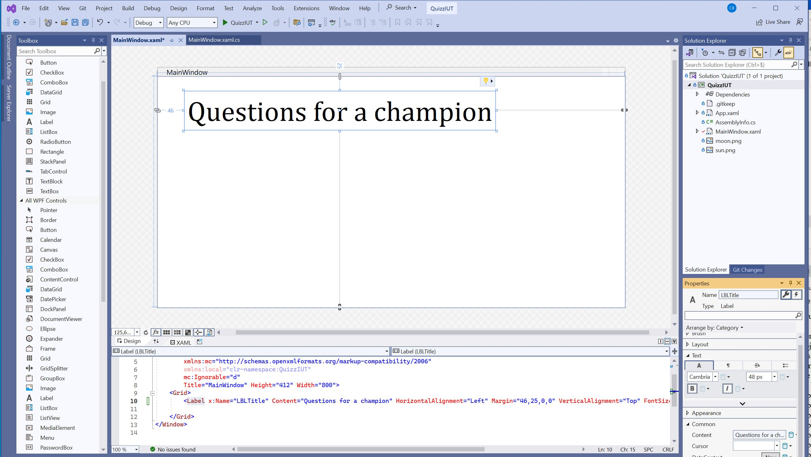

When you want to test your application, you can press the green arrow. This will launch the application in Debug mode. Close the application to stop Debug mode (or click on the stop button in Visual Studio) and return to programming mode.

### Creating the interface in XAML

First, we can concentrate on creating the interface, before tackling the code.

Add all the controls you need to create the interface (by dragging and dropping them from the toolbox).

In particular, in addition to the previous "LBLTitle" label, you'll need :
- a "LBLQuestion" label to display the question. For now, it will display an example text ("Insert your question here")
- a TextBox "TBXResponse" for the user to type their answer.
- a Button " BTNValidate " which allows the user to submit their answer.
- a Label "LBLCorrectAnswers" which simply displays the phrase "Correct answers:".
- a Label "LBLCorrectAnswersValue" which displays the current number of correct answers (currently 0).
- a Label "LBLIncorrectAnswers" which simply displays the phrase "Incorrect answers:".
- a Label "LBLIncorrectAnswersValue" which displays the current number of incorrect answers (currently 0).
- a Slider "SDRNightMode" configured to have only two values, 0 or 1 (which we'll use as a switch for Night mode).
- two Images, "IMGSun" and "IMGMoon" (a sun and a moon).

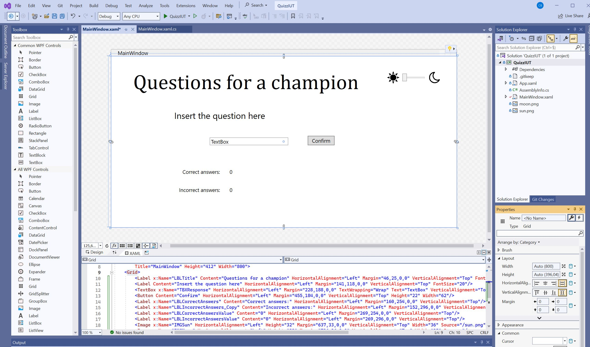

Once you've added, configured and correctly renamed all these controls, you can test your application by clicking on the green arrow. The application does nothing, but you should be able to see that the button is clickable, as is the slider.

### Executable code in C#

Now open the MainWindow.xaml.cs file.

In general, event-driven programming and the programming of graphical applications rely heavily on the concepts of object-oriented programming. In this file, you can see the definition of a MainWindow class that inherits from the Window class. This means that, by default, our MainWindow class is a basic window that does nothing. We're going to add functionalities to it so that it does what we want it to do.

First, select the window in Designer view or XAML view. You'll see that the Property view displays the window's properties. Click on the lightning bolt icon to display all the events this window can generate. 

We'll start by adding an event procedure that will be triggered when the window is displayed for the first time. It's in this procedure that we'll initialize our game.

Double-click on the "Loaded" event in the window.

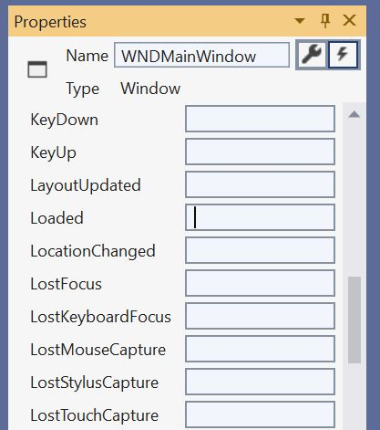

Automatically, an event-driven procedure has been added to the code of the MainWindow class in the MainWindow.cs file.

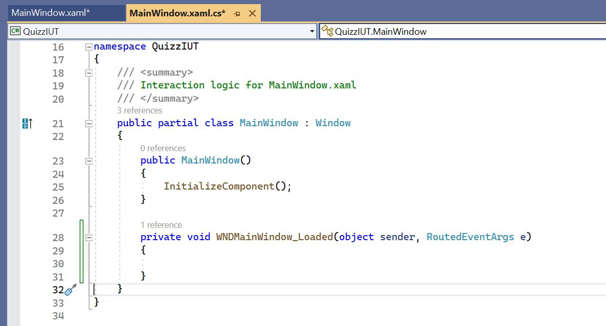

By default, Visual Studio will ask you to add an event-driven procedure to a control if you double-click on it from the Designer view. The event handled depends on the control. For a button, the event is **Click**. 
In the Designer view, double-click on the "BTNConfirm" button. An event procedure is immediately added to your code.

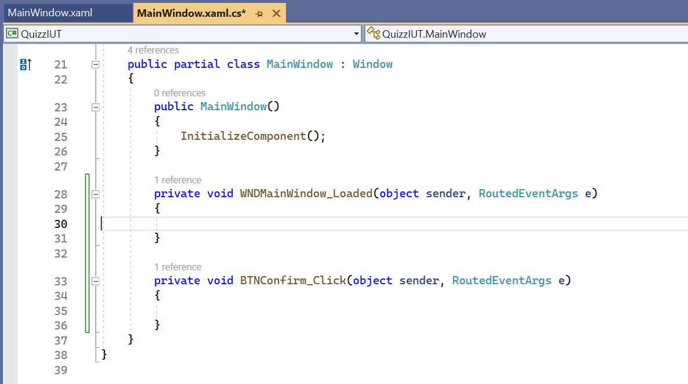

If you look in the button's events (Properties window -> lightning bolt button), you can even see that Visual Studio has associated this procedure with the button's **Click** event. All this would be perfectly modifiable by you later on, but for the moment, that's just what we want.

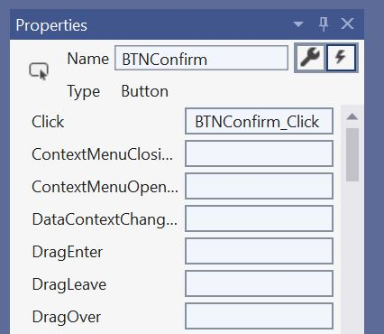

Do the same for the "SDRNightMode" slider by double-clicking on it from the Designer view. You'll see that its default event procedure is attached to its **ValueChanged** event. So it's different from the button. Again, all this is of course modifiable, it's just the default options.

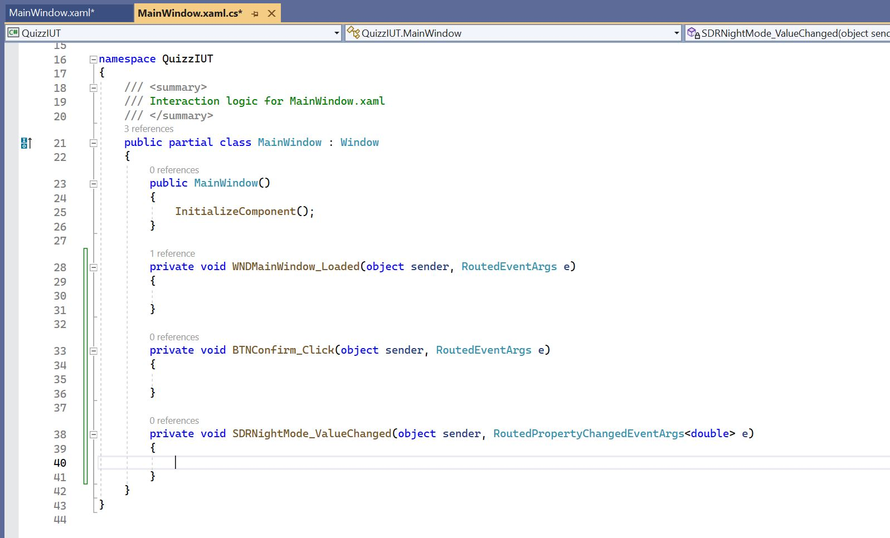

Add private attributes to your class to maintain the state of the game. In particular, we'll need :
- An integer to keep the number of the question we've reached.
- An integer to keep track of the number of correct answers.
- An integer to keep track of the number of incorrect answers.
- An array of strings containing the questions and an array of strings containing the answers.

Feel free to change and add your own questions and answers.

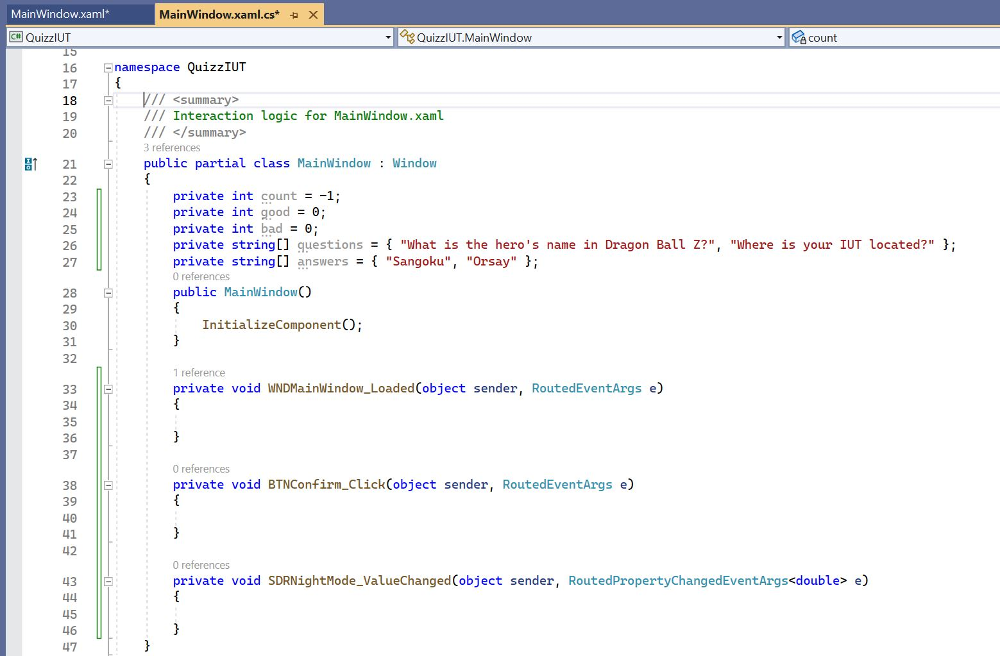

Write the NextQuestion method, which allows you to move on to the next question by increasing the counter and updating the contents of the "LBLQuestion" label with the value stored in the question array at the correct index. Make sure it's called when the application starts up, by calling it from the event procedure that reacts to window loading.


Now all you have to do is finish the game logic by completing the code for the event-driven procedures.

When you click on the "BTNConfirm" button, the contents of the corresponding event procedure must :
- Check whether the value in "TBXResponse" is equal to the value in the table at the correct index.
- If the value is correct, display **a MessageBox** with a congratulatory message ("Congrats! Good answer!"), increase the counter of correct answers and update the display of this counter ("LBLCorrectAnswersValue").
- If the value is incorrect, display **a MessageBox** with a message giving the correct answer, increase the counter of incorrect answers and update the display of this counter ("LBLIncorrectAnswersValue").
- Move on to the next question.

The **Help** section at the end of this lab will tell you where to go to find information and examples on **MessageBoxes** :wink:

When the value of the "SDRNightMode" slider changes, the content of the corresponding event procedure must :
- change the background color of the window.
- change the color of the texts of the 6 labels in your application.

### Submit your work

Don't forget to submit your work to your teacher with the **travo** command:
```
python travoIHM.py submit tpihm2 ####
```
> replacing #### with your group ID **tp2a** or **tp2b** etc... Once again, don't get the wrong group...

## Help

Don't forget to consult the documentation on the Microsoft web site, particularly on the use of MessageBoxes. 

https://learn.microsoft.com/en-us/dotnet/desktop/wpf/windows/how-to-open-message-box?view=netdesktop-6.0

You'll find explanations and sample code that you can use as inspiration for your own functionalities.
