# TPIHM2 – Première fenêtre de champion

Dans ce TP, nous allons découvrir la programmation événementielle en réalisant une première fenêtre interactive pour une application de Quiz!.

## Travail à rendre

A la fin des deux séances (un total de 4 heures de travail), vous devrez soumettre votre projet à l'aide de **travo**.

## Le sujet

IUT Télévision cartonne sur Twitch avec leur dernière émission de Quizz. Ils veulent en profiter pour lancer une application mobile pour accumuler encore plus de followers, mais avant, ils veulent réaliser un prototype en WPF pour vérifier comment cette application pourrait fonctionner.

Ils ont donc demandé aux étudiants de l'IUT de réaliser ce prototype.

Leur équipe de conception a réalisé la maquette suivante:

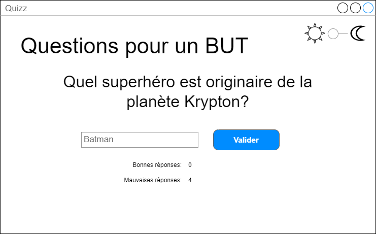

Les fonctionnalités attendues sont :
- Pouvoir passer du mode Nuit au mode Jour (contrôles en haut à droite)
- Afficher une question et permettre à l'utilisateur de saisir une réponse
- Afficher le nombre de questions correctement répondues ainsi que le nombre de questions ratées.
- Une fois que l'utilisateur a saisi sa réponse, **un MessageBox** lui indique si sa réponse est correcte ou fausse (lui indique quelle était la bonne réponse dans ce cas), puis une autre question est proposée.
- Proposer au moins dix questions différentes

Les fonctionnalitées additionnelles sont :
- Jouer un son lorsque la réponse est bonne ou fausse 

## (1) Récupérer le projet à l'aide de **travo**
<details>
  <summary>Voir les instructions pour récupérer et soumettre le projet (important)</summary> 

> Pour récupérer le projet et le soumettre à la fin des deux séances, vous allez devoir utiliser le script **travo** fourni par le responsable du module. Télécharger ce script [**travoIHM.py**](https://ihm.gitpages.iut-orsay.fr/cours/travoIHM.py) dans votre espace personnel (quelque part dans le lecteur Z:).
> 
> > **travo** est un ensemble de scripts Python maintenu par des enseignants chercheurs de Paris-Saclay et du Québec facilitant l'utilisation de GIT pour les enseignants. En fait les commandes **travo** effectuent un ensemble de commande GIT pour vous. **travo** ainsi que Python sont déjà installés sur les ordinateurs de l'IUT.
> > 
> > Vous pouvez utiliser votre propre ordinateur et installer **travo** dessus (à condition d'avoir installé Python au préalable bien sûr) à l'aide de la commande: 
> > ```
> > pip install travo
> > ```
> 
> Sur l'ordinateur de l'IUT, rendez-vous dans le répertoire C:\WinPython et lancer le programme "WinPython Powershell Prompt.exe", un terminal Powershell va s'ouvrir, prêt à recevoir des commandes Python.
> A l'intérieur de ce terminal PowerShell, tapez d'abord la commande suivante, vous permettant de vous déplacer dans > votre espace personnel :
> 
> ```
> cd Z:\
> ```
> 
> Si vous tapez la commande **ls**, vous devriez voir dans la liste des fichiers de ce répertoire, le script **travoIHM.py** que vous avez téléchargé précédemment (bien sûr, vous pouvez travailler dans un autre répertoire que la racine du répertoire Z:).
> 
> Enfin, pour récupérer le projet, il vous suffit de taper la commande :
> 
> ```
> python travoIHM.py fetch tpihm2
> ```
> 
> Il vous sera demandé vos identifiants ADONIS (de l'IUT) puis le projet sera téléchargé sur votre ordinateur (dans le répertoire "tpihm2"). Si une fenêtre d'authentification s'ouvre alors que vous avez déjà saisi vos identifiants dans le terminal Powershell, vous pouvez la fermer.
> 
> Sauvegarder ou soumettre votre travail à l'enseignant se fera à l'aide de la commande : 
> ```
> python travoIHM.py submit tpihm2 ####
> ```
> Il vous faut remplacer #### par votre identifiant de groupe **tp2a** ou **tp2b** etc... Ne vous trompez pas de groupe, ce sera des points en moins (si vous avez fait une erreur, vous pouvez resoumettre en mettant le bon groupe et travo se chargera de corriger l'erreur, donc pas de panique)
> 
> Vous pouvez faire autant de "submit" que vous voulez. C'est une bonne pratique pour ne pas perdre votre travail.

</details>

## Projet Visual Studio, .Net, WPF et C#
<details>
  <summary>Voir des informations sur ce qu'est un projet WPF .Net</summary> 

> ### Visual Studio
> 
> Dans ce cours d'IHM, nous utiliserons l'environnement de développement de Microsoft **Visual Studio Community** (à ne pas confondre avec **Visual Studio Code**, très populaire et très sympa mais qui n'a pas les fonctionnalités dont nous avons besoin ici) ainsi que les bibliothèques de composants graphiques WPF (Windows Presentation Foundation) du Framework **.Net**.
> 
> ### .Net
> 
> Le framework .Net est un environnement logiciel développé par Microsoft disponible depuis les dernières évolutions sur les différents OS principaux (en fonction des versions) : Windows, MacOS et Linux. 
> 
> D’une manière similaire à la machine virtuelle Java, le framework .Net a pour ambition d’abstraire la couche de fonctionnement plutôt bas-niveau de la machine en utilisant un intermédiaire entre le code écrit par le programmeur et la machine.
> 
> Lors de vos premiers cours, vous avez appris à compiler du code (en C ou C++) en langage machine (un exécutable binaire que la machine comprend et peut exécuter directement). 
> 
> Dans une application .Net, le code (C#, VB.Net ou même C++) est d’abord converti par un compilateur en langage intermédiaire (en CIL) et non pas en langage machine (la machine ne peut donc pas l’exécuter tout de suite). 
> Lors de l’exécution, c’est en réalité le Common Language Runtime CLR de .Net (qui fonctionne un peu comme une machine virtuelle Java, un intermédiaire) qui prend ce langage intermédiaire et le compile à la volée en langage machine (Just-In-Time compilation) afin de déclencher et contrôler son exécution.
> 
> Cette « machine virtuelle » permet donc de pouvoir observer et d’agir sur le code en train de s’exécuter (débogage, gestion de la mémoire, introspection etc…) là où une application standard est beaucoup plus figée et moins flexible une fois compilée.
> 
> ### Le XAML et le C#
> 
> Afin de programmer des applications en WPF, nous avons besoin de deux langages :
> - le XAML, qui est un format XML (comme le HTML est un format XML) qui va nous servir à décrire l'interface graphique de notre application (où sont les boutons, les textes, la taille de la fenêtre etc...)
> - le C#, un des langages du TOP5 du classement TIOBE, qui va nous servir pour réaliser la partie fonctionnelle de l'application
> 
> Les frameworks traditionnels d'applications graphiques (comme Java Swing, C# Winforms, Python Tkinter ou C++ QT) utilisent en général un seul langage. 
> 
> Chaque approche a ses avantages et ses inconvénients, cette façon de travailler avec deux langages est inspirée du web (HTML pour l'interface, Javascript pour le code exécutable) et va nous permettre d'introduire les concepts plus tranquillement.
> 

</details>

## (2) Une Solution Visual Studio .sln

Dans le monde de Visual Studio, tous les fichiers d'un projet sont réunis dans ce que l'on appelle une **solution**. La description de la solution est sauvegardée sous la forme d'un fichier **.sln**. 

Tu pourrais parfaitement créer un nouveau projet "Application C# WPF" dans Visual Studio, ce qui te créérait une nouvelle solution, mais nous avons préparé une solution vide dans laquelle tu vas travailler.

Va dans le répertoire **tpihm2** que tu as récupéré grâce à **travo** et double-clic sur le fichier **.sln**. Visual Studio devrait ouvrir ton projet / ta solution. Un projet WPF est constitué par défaut d'un ensemble de fichiers qui peuvent sembler un peu obscurs. Nous n'avons pas besoin de tous les comprendre pour le moment, dans ce TP nous allons nous focaliser sur les fichiers qui nous intéressent.

Les deux choses sur lesquelles j'attire ton attention sont :
- Ne cherche pas tout de suite une fonction Main() (comme en Java et en C++). Elle existe (si tu cherches dans tous les fichiers, tu finiras par la trouver) mais normalement nous n'avons pas besoin de la modifier.
- La présence des fichiers MainWindow.xaml et MainWindow.xaml.cs, qui vont nous permettre de réaliser la fenêtre et son comportement.

Normalement, la vue Designer doit s'ouvrir et te montrer une fenêtre vide, si ce n'est pas le cas, utilise l'explorateur de solutions sur la droite pour trouver le fichier MainWindow.xaml et double clic dessus pour l'ouvrir.

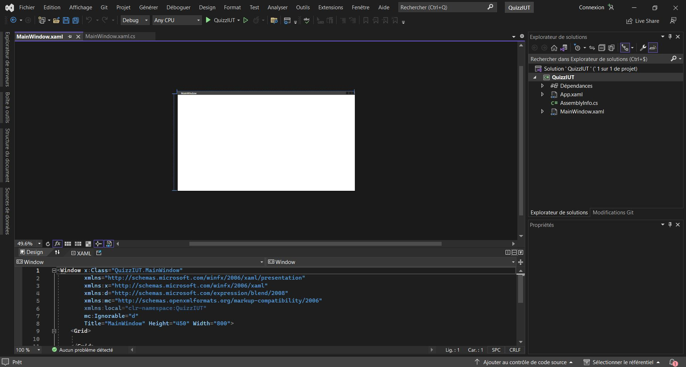

### Un mot sur le C# et ses classes partielles

La façon d'organiser le code d'un programme change un peu entre C++, Java et C#. En Java, il n'est pas possible par exemple d'écrire le code d'une Classe dans deux fichiers, le code d'une classe doit être réuni dans un seul fichier.

En C#, c'est possible avec l'utilisation du mot clé "partial" devant le nom d'une classe. Grâce à ce mot-clé, on peut définir le code d'une classe dans chaque fichier qui contient le nom de la classe précédé du mot "partial".

Nous y reviendrons plus tard...

## (3) Présentation de l'environnement de développement

L'interface de Visual Studio est décomposée en différentes vues qui peuvent être redéplacées, ajoutées, supprimées...

Par défaut, tu devrais avoir une disposition similaire à celle-ci :

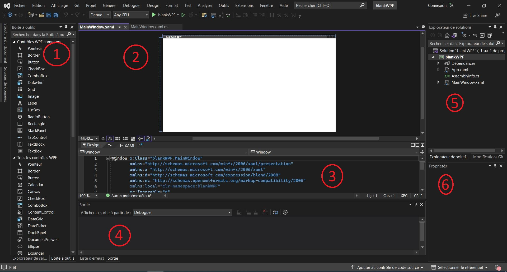

- 1. La boîte à outils, qui contient la liste des contrôles que tu peux ajouter à ton application. Il est possible que cette vue soit repliée tout à gauche. Tu peux la laisser visible en cliquant sur l'épingle lorsqu'elle est dépliée.

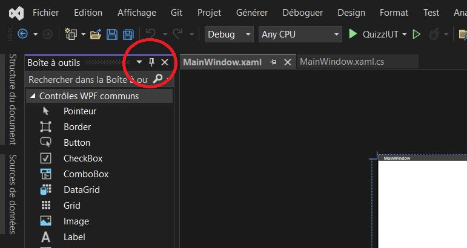

- 2. La vue Designer, qui te permet de manipuler directement les contrôles que tu as ajoutés (changer leur taille, leur position) ainsi que la fenêtre.

- 3. La vue XAML, qui te permet d'éditer le code XAML qui décrit le contenu de ton application. La vue Designer est une représentation visuelle du code XAML qui décrit l'interface graphique de notre application. Tu peux voir le vrai contenu XAML dans la vue XAML, juste en dessous de la vue Designer. Ces deux vues sont synchronisées. Une modification dans la vue XAML se voit dans la vue Designer et une modification dans la vue Designer est immédiatement répercutée dans la vue XAML. Pour l'instant notre XAML ne contient qu'une fenêtre (Window), qui contient elle-même une grille (Grid). Tu retrouves ici le principe d'une arborescence XML similaire à celle d'HTML. Plus d'informations sont disponibles dans la documentation de Microsoft (https://learn.microsoft.com/en-us/visualstudio/xaml-tools/xaml-code-editor?view=vs-2022)

- 4. La vue Sortie (Output), qui affichera les messages du compilateur si tu as une erreur dans dans ton code, et qui affichera également les messages écrits dans la console pendant l'exécution du programme.

- 5. La vue de l'explorateur de solutions, qui permet de lister l'ensemble des fichiers du projet / de la solution.

- 6. La vue Propriété, une des vues les plus importantes et pourtant un peu discrète. Lorsqu'un élément est sélectionné dans la vue Designer ou XAML, la vue Propriété montre tous les attributs de cet élément qui peuvent être modifiés. C'est ici que tu peux changer la taille, la couleur, le nom de chaque élément. Toutes ces propriétés peuvent également être éditées directement depuis le code XAML.

## (4) Instructions

Commence par rajouter un Label à ta fenêtre en le faisant glisser depuis la Boite à outils vers la vue Designer (tu comprends que tu pourrais également l'ajouter en écrivant directement son code dans le fichier XAML).

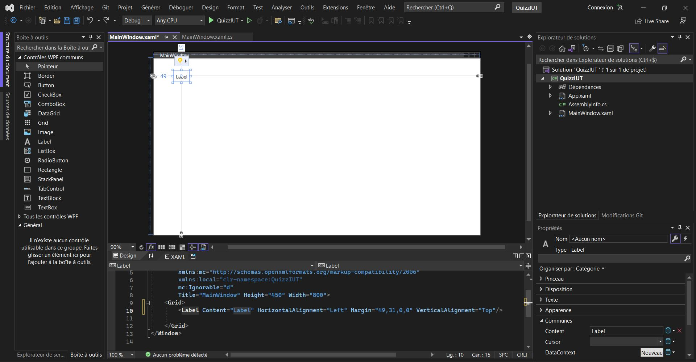

[-Important: je te demanderai à chaque fois que tu ajoutes un élément dans l'interface graphique, de changer sa propriété "Name"/"Nom" en suivant la convention suivante : Trois premières lettres en majuscules qui décrivent le type de contrôle, suivi d'un mot explicite-]

Change la propriété "Name"/"Nom" de ce contrôle en "LBLTitre".

Profites-en pour changer également le "Name"/"Nom" de la fenêtre en "WNDFenetrePrincipale". Attention à ne pas sélectionner la grille à l'intérieur de la fenêtre, mais bien la fenêtre (en cliquant bien sur les bords par exemple).

Change ses propriétés (à toi de chercher et de trouver lesquelles) pour qu'il affiche en grand la phrase "Questions pour un BUT".

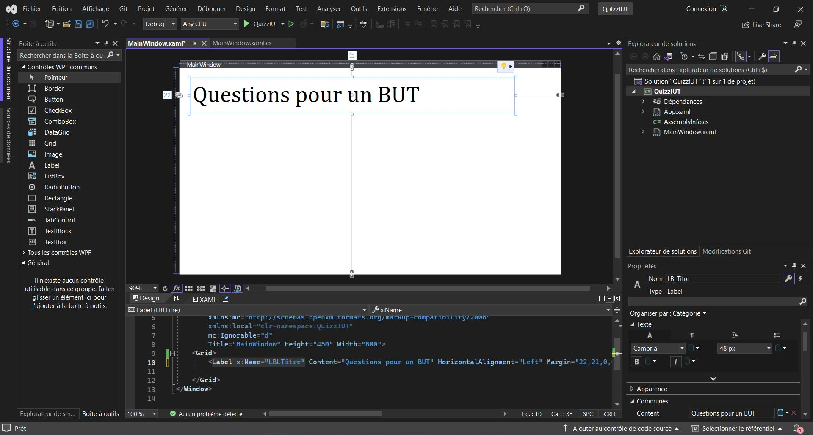

Lorsque tu souhaites tester ton application, tu peux appuyer sur la flèche verte. Cela lancera l'application en mode Debug. Ferme l'application pour arrêter le mode Debug (ou clic sur le bouton stop dans Visual Studio) et revenir en mode programmation.

### Réalisation de l'interface en XAML

Dans un premier temps, nous pouvons nous concentrer sur la réalisation de l'interface avant d'attaquer le code.

Rajoute tous les contrôles dont tu as besoin pour réaliser l'interface (en les faisant glisser-déposer depuis la boîte à outils).

En particulier tu auras besoin, en plus du label "LBLTitre" précédent, de :
- un Label "LBLQuestion" qui servira à afficher la question. Pour l'instant il affichera un texte d'exemple ("Insérez votre question ici")
- un TextBox "TBXReponse" qui servira pour l'utilisateur à taper sa réponse.
- un Button "BTNValider" qui permet à l'utilisateur de soumettre sa réponse.
- un Label "LBLBonnesReponses" qui affiche simplement la phrase "Bonnes réponses:"
- un Label "LBLBonnesReponsesValeur" qui affiche le nombre courant de bonnes réponses (pour l'instant 0).
- un Label "LBLMauvaisesReponses" qui affiche simplement la phrase "Mauvaises réponses:"
- un Label "LBLMauvaisesReponsesValeur" qui affiche le nombre courant de mauvaises réponses (pour l'instant 0).
- un Slider "SDRModeNuit" configuré pour n'avoir que deux valeurs, 0 ou 1 (qui va nous servir d'interrupteur pour le mode Nuit).
- deux Images, "IMGSun" et "IMGMoon" (un soleil et une lune).

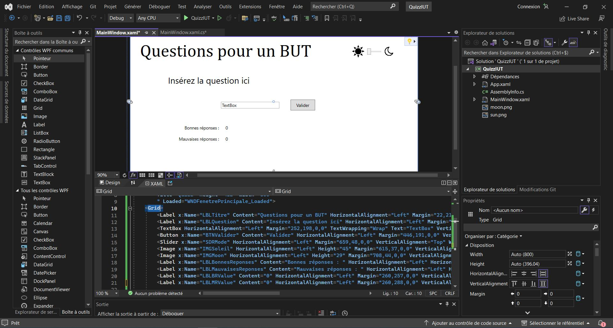

Une fois que tu as ajouté, configuré et correctement renommé tous ces contrôles, tu peux tester ton application en cliquant sur la flèche verte. L'application ne fait rien, mais tu devrais pouvoir constater que le bouton est cliquable, ainsi que le slider.

### Le code exécutable en C#

Ouvre maintenant le fichier MainWindow.xaml.cs.

De manière générale, la programmation événementielle et la programmation d'applications graphiques s'appuient énormément sur les notions de la programmation Orientée-Objet. Tu peux voir dans ce fichier la définition d'une classe MainWindow qui hérite de la classe Window. Cela veut dire que par défaut, notre classe MainWindow est une fenêtre de base, qui ne fait rien. Nous allons lui ajouter des fonctionnalités pour qu'elle fasse ce que l'on souhaite.

Tout d'abord, sélectionne la fenêtre dans la vue Designer ou dans la vue XAML (fais bien attention encore à ne pas sélectionner la grille). Tu verras que la vue Propriété affiche les propriétés de la fenêtre. Clic sur l'icône en forme d'éclair pour afficher tous les événements que peut générer cette fenêtre. 

Nous allons commencer par ajouter une procédure événementielle qui se déclenchera lorsque la fenêtre s'affichera pour la première fois. C'est dans cette procédure que nous pourrons initialiser notre jeu.

Double-clic dans l'évenement "Loaded" de la fenêtre.

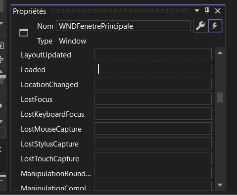

Automatiquement, une procédure événementielle a été ajoutée au code de la classe MainWindow dans le fichier MainWindow.xaml.cs

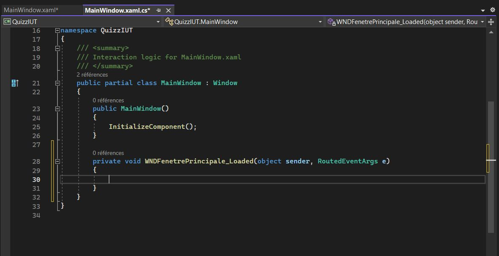

Par défaut, Visual Studio va te proposer d'ajouter une procédure événementielle à un contrôle si tu double-clic dessus depuis la vue Designer. L'événement géré est différent en fonction du contrôle. Pour un bouton, l'événement est le **Click**. 
Dans la vue Designer, double-clic sur le bouton "BTNValider". Une procédure événementielle est immédiatement ajoutée à ton code.

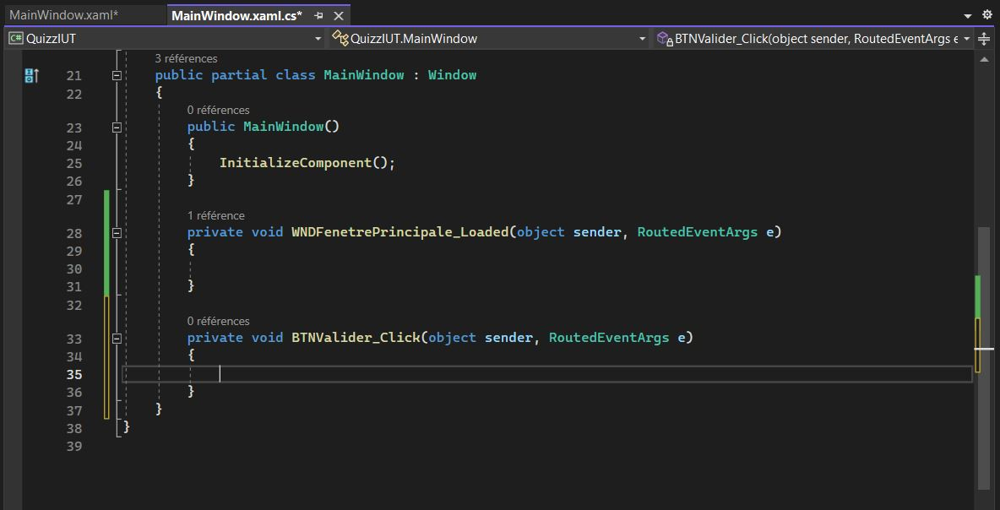

si tu regardes dans les événements du bouton (la fenêtre des Propriétés -> bouton en forme d'éclair), tu peux même voir que Visual Studio a associé cette procédure à l'événement **Click** de ce bouton. Tout ceci serait parfaitement modifiable par toi ensuite, mais pour l'instant, c'est bien ce que nous voulons.

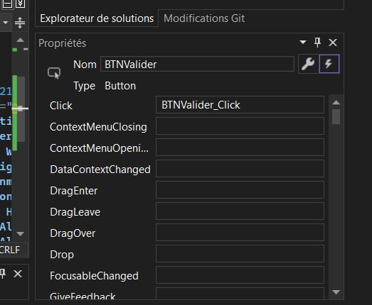

Fais la même chose pour le slider "SDRModeNuit" en doucle-cliquant dessus depuis la vue Designer. Tu vois que sa procédure événementielle par défaut est attachée à son événement **ValueChanged** (changement de valeur). C'est donc différent du bouton. Encore une fois, tout ceci est bien évidemment modifiable, il s'agit simplement des options par défaut.

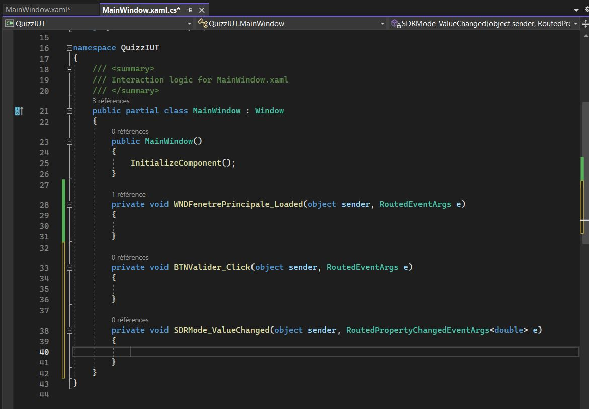

Rajoute dans ta classe les attributs privés pour conserver l'état du jeu. Nous aurons besoin notamment de :
- Un entier pour conserver le numéro de la question où nous sommes rendus
- Un entier pour conserver le nombre de bonnes réponses
- Un entier pour conserver le nombre de mauvaises réponses
- Un tableau de string contenant les questions et un tableau de string contenant les réponses

N'hésite pas à changer et à rajouter tes propres questions et réponses

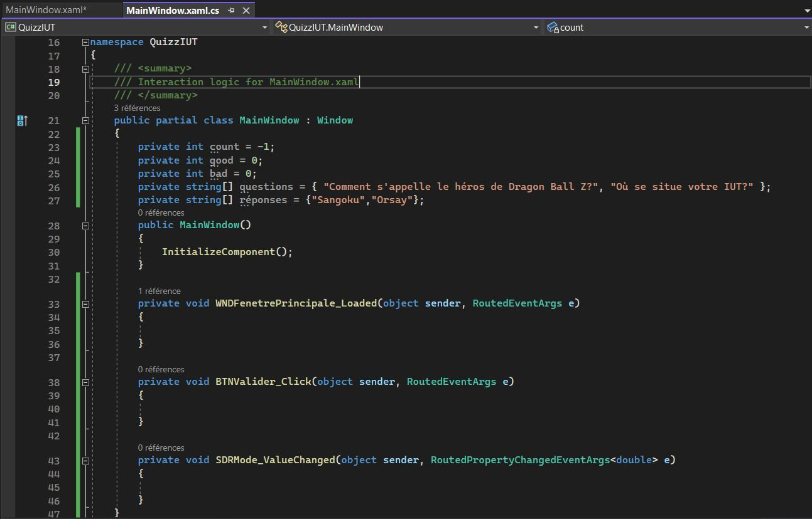

Ecris la méthode NextQuestion, qui permet de passer à la question suivante en augmentant le compteur et en mettant à jour le contenu du Label "LBLQuestion" avec la valeur stockée dans le tableau des questions au bon indice. Fais en sorte qu'elle soit appellée au démarrage de l'application en l'appelant depuis la procédure événementielle qui réagit au chargement de la fenêtre.

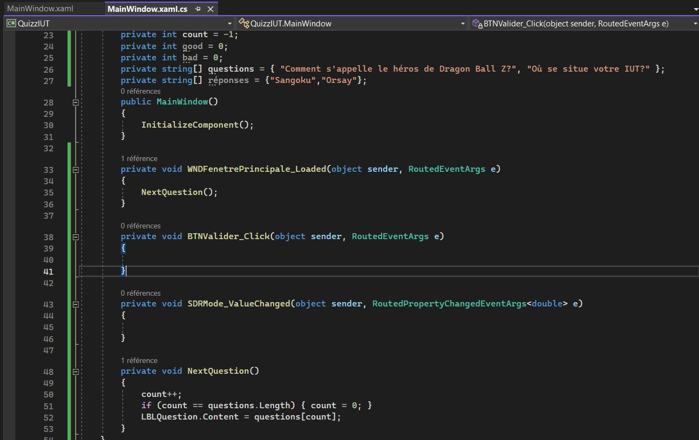

Il ne te reste plus maintenant qu'à finir la logique du jeu en complétant le code des procédures événementielles. 

Lorsque tu cliques sur le bouton "BTNValider", le contenu de la procédure événementielle correspondante doit :
- Vérifier si la valeur dans "TBXReponse" est égale à la valeur dans le tableau au bon indice.
- Si la valeur est correcte, afficher **un MessageBox** avec un message de félicitations ("Bravo! Bonne réponse!"), augmenter le compteur de bonnes réponses et mettre à jour l'affichage de ce compteur ("LBLBonnesReponsesValeur")
- Si la valeur est incorrecte, afficher **un MessageBox** avec un message expliquant qu'elle aurait du être la bonne réponse, augmenter le compteur de mauvaises réponses et mettre à jour l'affichage de ce compteur ("LBLMauvaisesReponsesValeur")
- Passer à la question suivante

Lorsque la valeur du slider "SDRModeNuit" change, le contenu de la procédure événementielle correspondante doit :
- changer la couleur de fond de la fenêtre
- changer la couleur des textes des 6 Labels de ton application

La rubrique **Aide** à la fin de ce fichier t'indiquera où aller trouver de l'information et des exemples sur les **MessageBox** :wink: 

### Soumettre ton travail

N'oublie pas de soumettre ton travail à l'enseignant avec la commande **travo** 
```
python travoIHM.py submit tpihm2 ####
```
> en remplaçant #### par ton identifiant de groupe **tp2a** ou **tp2b** etc... Encore une fois, ne te trompe pas de groupe...

## Aide

N'oublie pas d'aller consulter la documentation sur le site de Microsoft, en particulier sur l'utilisation des MessageBox. 

https://learn.microsoft.com/en-us/dotnet/desktop/wpf/windows/how-to-open-message-box?view=netdesktop-6.0

Tu trouveras des explications ainsi que des morceaux de code d'exemple dont tu peux t'inspirer pour réaliser tes fonctionnalités.
