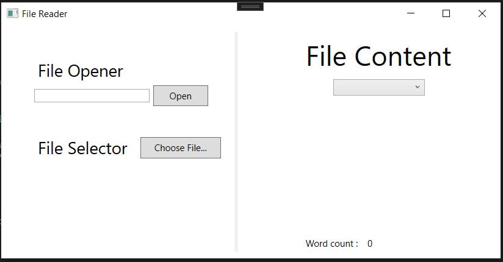
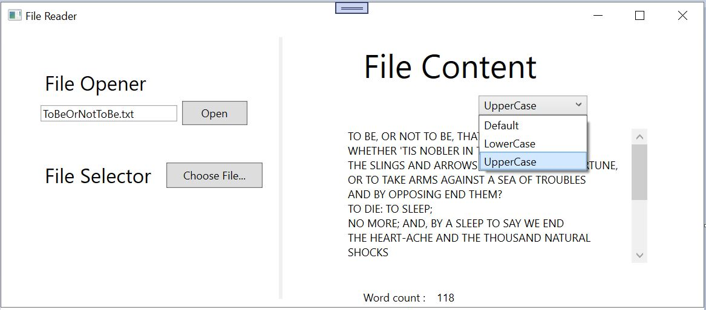
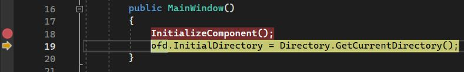
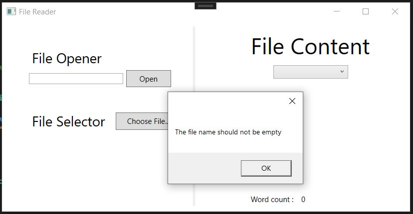
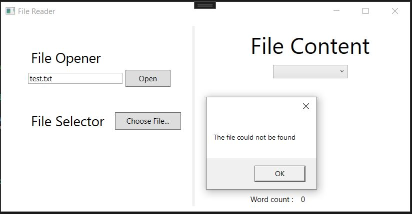

# Lab3 - Debugging 
In this lab, we'll learn how to use some of the features of modern development environments.


## Work to hand in

At the end of the session (a total of 2 hours' work), you'll have to submit your project using **travo**..

## The topic

The CCRI needs a tool to consult the contents of certain files. So they asked an IUT student to create this application for them. However, he must have been sleeping in the back of the lecture hall, as his code doesn't work at all.

Here's what we should have:




This is a very simple application which should offer the following functionalities:
- Enter the name of a file in the application's current directory and click on the "Open" button to display the contents on the right (for the moment, you can use the "ToBeOrNotToBe.txt" file already supplied, but you could use another).
    - If no file name is entered, the program should display a MessageBox with a corresponding error message.
    - If a file name is entered but not found, the program should display a MessageBox with a corresponding error message.

- Alternatively, click on the "Choose File..." button, which opens a file selection dialog box. The result is the same, with the file displayed on the right.
- Display the number of words in the file that has just been loaded at the bottom.
- Use the ComboBox at top right to change the text displayed to either upper or lower case, or to its default value.

## (1) Retrieve the project using **travo**.
<details>
  <summary>See instructions here to retrieve and submit the project (*important*)</summary> 

> To retrieve the project and submit it at the end of the two sessions, you'll need to use the **travo** script provided by the teacher responsable for this course. Download this script [**travoIHM.py**](https://ihm.gitpages.iut-orsay.fr/cours/travoIHM.py) to your personal space (somewhere in drive Z:).
> 
> > **travo** is a set of Python scripts maintained by teachers & researchers from Paris-Saclay and Quebec, making it easier for teachers to use GIT. In fact, **travo** commands perform a set of GIT commands for you. Both **travo** and Python are already installed on IUT computers.
> > 
> > You can use your own computer and install **travo** on it (provided you've installed Python beforehand, of course) using the command: 
> > ```
> > pip install travo
> > ```
> 
> On the IUT computer, go to the C:WinPython directory and run the "WinPython Powershell Prompt.exe" program. A Powershell terminal will open, ready to receive Python commands.
> Inside this PowerShell terminal, first type the following command, enabling you to move to your personal space:
> 
> ```
> cd Z:\
> ```
> 
> If you type the **ls** command, you should see the **travoIHM.py** script you downloaded earlier in the list of files in this directory (of course, you can work in a directory other than the root of the Z: directory).
> 
> Finally, to retrieve the project, simply type the command :
>
> ```
> python travoIHM.py fetch tpihm3
> ```
> 
> You will be asked for your ADONIS (IUT) login information, and the project will be downloaded to your computer (in the "tpihm3" directory). 
> 
> Save or submit your work to the teacher using the command: 
> ```
> python travoIHM.py submit tpihm3 ####
> ```
> You need to replace #### with your group ID **tp2a** or **tp2b** etc... Don't get the wrong group, you'll lose points!
> 
> You can submit as many times as you like. It's good practice not to lose your work.

</details>

## (2) Correct errors

### Compilation errors
The first part of the job is to correct compilation errors. Normally, Visual Studio makes your work easier by proposing automatic corrections when it understands what the error is. Nevertheless, take the time to look at the error message, understand what the problem is and look at the solution proposed by Visual Studio if there is one.

You may also need to refer to Microsoft documentation to help you solve problems.

### Runtime errors
There are buttons that don't seem to work, Exceptions aren't handled when there are problems with the file name, the word count doesn't seem to be correct and nothing is displayed on the right...

You should use the step-by-step mode as well as spies to understand what's going on (you could do it without, but the point of the exercise is to get to grips with this great feature of your IDE, so give it a try!).

Remember: 
- To place a breakpoint, you need to make a red circle appear, by clicking in the column to the left of the line numbers, at the level of the line where you want to place the breakpoint. You can place more than one spy.


- When you run your program from Visual Studio, if it reaches a breakpoint, then it pauses on it and you enter step-by-step mode.
- Once in step-by-step mode, you can consult the values of all variables accessible in the context where your program is located in the variable list view (bottom left). You can also add spies on specific variables by right-clicking on the variable in your code and choosing the "Add Spy" option (this lets you keep an eye on particular variables instead of searching for them in the variable list).
- Once in step-by-step mode, you can advance line by line through the program by pressing "F10". In this way, you can follow the changes to your variables at each step of your program. You can also move down the list of methods that are called by pressing "F11", and move back up by pressing "Shift+F11".
 


To exit step-by-step mode and restart the program at full speed, you can press "F5" or click on the green "Continue" triangle. The program will stop again if it encounters another stopping point.

### Exception handling
If you try to load a file, the program may throw Exceptions if you haven't typed anything into the TextBox, or if the file you typed in isn't found. Try to figure out which line of code generates these Exceptions (the program should crash). Add the code (using Try/Catch) to display a MessageBox with the correct error message if this is the case, in order to bypass the crash and explain the problem to the user.





### Submit your work
Don't forget to submit your work to your teacher with the **travo** command.
```
python travoIHM.py submit tpihm3 ####
```
replacing #### with your group ID **tp2a** or **tp2b** etc... Once again, don't get the wrong group...