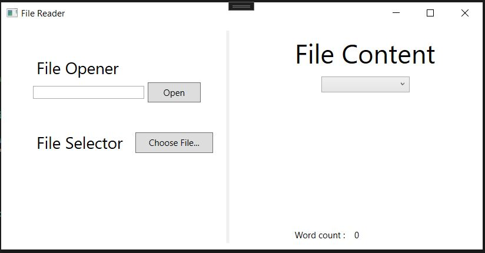

# TPIHM3 – Débogage de projet 

Dans ce TP, nous allons prendre en main certaines fonctionnalités des environnements de développements modernes.

## Travail à rendre

A la fin de la séance (un total de 2 heures de travail), vous devrez soumettre votre projet à l'aide de **travo**.

## Le sujet

Le CCRI a besoin d'un outil pour consulter le contenu de certains fichiers. Ils ont donc demandé à un étudiant de l'IUT de leur réaliser cette application. Cependant, celui-ci devait dormir dans le fond de l'amphithéatre car son code ne fonctionne absolument pas.

Voici ce que nous devrions avoir :




C'est une application très simple qui doit offrir les fonctionnalités suivantes :
- Saisir le nom d'un fichier dans le répertoire courant de l'application et cliquer sur le bouton "Open" pour afficher le contenu à droite (pour l'instant, tu peux utiliser le fichier "cigaleetfourmi.txt" déjà fourni mais tu pourrais en utiliser un autre)
    - Si aucun nom de fichier n'est saisi, le programme doit afficher un MessageBox avec un message d'erreur correspondant.
    - Si un nom de dichier est saisi mais que le programme ne le trouve pas, le programme doit afficher un MessageBox avec un message d'erreur correspondant

- Ou alors, cliquer sur le bouton "Choose File..." qui a pour effet d'ouvrir une boîte de dialogue de sélection de fichiers. Le résultat est le même ensuite, le fichier doit s'afficher à droite.
- Afficher en bas le nombre de mots contenus dans le fichier chargé
- Permettre à l'aide de la ComboBox en haut à droite de changer le texte affiché soit en Majuscule, soit en Minuscule, soit à sa valeur par défaut.

## (1) Récupérer le projet à l'aide de **travo**
<details>
  <summary>Voir les instructions pour récupérer et soumettre le projet (*important*)</summary> 

> Pour récupérer le projet et le soumettre à la fin des deux séances, vous allez devoir utiliser le script **travo** fourni par le responsable du module. Télécharger ce script [**travoIHM.py**](https://ihm.gitpages.iut-orsay.fr/cours/travoIHM.py) dans votre espace personnel (quelque part dans le lecteur Z:).
> 
> > **travo** est un ensemble de scripts Python maintenu par des enseignants chercheurs de Paris-Saclay et du Québec facilitant l'utilisation de GIT pour les enseignants. En fait les commandes **travo** effectuent un ensemble de commande GIT pour vous. **travo** ainsi que Python sont déjà installés sur les ordinateurs de l'IUT.
> > 
> > Vous pouvez utiliser votre propre ordinateur et installer **travo** dessus (à condition d'avoir installé Python au préalable bien sûr) à l'aide de la commande: 
> > ```
> > pip install travo
> > ```
> 
> Sur l'ordinateur de l'IUT, rendez-vous dans le répertoire C:\WinPython et lancer le programme "WinPython Powershell Prompt.exe", un terminal Powershell va s'ouvrir, prêt à recevoir des commandes Python.
> A l'intérieur de ce terminal PowerShell, tapez d'abord la commande suivante, vous permettant de vous déplacer dans votre espace personnel :
> 
> ```
> cd Z:\
> ```
> 
> Si vous tapez la commande **ls**, vous devriez voir dans la liste des fichiers de ce répertoire, le script **travoIHM.py** que vous avez téléchargé précédemment (bien sûr, vous pouvez travailler dans un autre répertoire que la racine du répertoire Z:).
> 
> Enfin, pour récupérer le projet, il vous suffit de taper la commande :
> 
> ```
> python travoIHM.py fetch tpihm3
> ```
> 
> Il vous sera demandé vos identifiants ADONIS (de l'IUT) puis le projet sera téléchargé sur votre ordinateur (dans le répertoire "tpihm3"). 
> 
> Sauvegarder ou soumettre votre travail à l'enseignant se fera à l'aide de la commande : 
> ```
> python travoIHM.py submit tpihm3 ####
> ```
> Il vous faut remplacer #### par votre identifiant de groupe **tp2a** ou **tp2b** etc... Ne vous trompez pas de groupe, ce sera des points en moins
> 
> Vous pouvez faire autant de "submit" que vous voulez. C'est une bonne pratique pour ne pas perdre votre travail.
>
> > ### Ajouter un fichier à un projet récupéré
> > 
> > La plupart des projets que vous allez récupérer avec travo contient a priori tous les fichiers dont vous avez besoin. Cependant il est possible que vous ayez besoin d'ajouter des fichiers (des images, des sons, des classes, que sais-je...) à vos projets, afin qu'ils se retrouvent sur le Git.
> > 
> > **travo** ne regarde pas s'il y a de nouveaux fichiers dans vos projets.
> > 
> > Cependant, vous pouvez tout à fait utiliser les commandes **git add** que vous avez dû voir en cours de [Qualité de développement](https://hoangla95.github.io/qualitedevs2/tp1) en vous plaçant dans le répertoire du projet.
> >
> > Une fois les fichiers ajoutés avec la commande **git add**, travo les prendra en compte lors du **submit**.

</details>

## (2) Corriger les erreurs

### Erreur à la compilation
La première partie du travail consiste à corriger les erreurs de compilation. Normalement, Visual Studio vous mâche le travail en vous proposant des corrections automatiques lorsqu'il comprend quelle est l'erreur. Prenez néanmoins le temps de regarder le message d'erreur, de comprendre quel est le problème en regardant la solution proposée par Visual Studio s'il y en a une.

Tu pourrais être amené à aller sur la documentation de Microsoft pour t'aider à résoudre les problèmes.

### Erreur à l'exécution
Il y a des boutons qui semblent ne pas fonctionner, les Exceptions ne sont pas gérées en cas de problèmes avec le nom du fichier, le comptage des mots semble ne pas être correcte et rien ne s'affiche à droite...

Tu devrais utiliser le mode pas à pas et les espions pour comprendre ce qu’il se passe (tu pourrais y arriver sans, mais le but de l’exercice est justement de prendre en main cette super fonctionnalité de ton IDE alors profites-en pour essayer !).

Rappelle-toi : 
- Pour placer un point d’arrêt, tu dois faire apparaître un rond rouge, en cliquant dans la colonne à gauche des numéros de ligne, au niveau de la ligne où tu veux mettre le point d’arrêt. Tu peux en placer plusieurs.


- Lorsque tu lances ton programme depuis Visual Studio, si celui-ci atteint le point d’arrêt alors il se met en pause dessus et tu entres en mode pas à pas.
- Une fois en mode pas à pas, tu peux consulter les valeurs de toutes les variables accessibles dans le contexte où se trouve ton programme dans la vue liste des variables (en bas à gauche). Tu peux également ajouter des espions sur des variables précises en faisant un clic droit sur la variable dans ton code et en choisissant l’option « Ajouter un Espion » (cela te permet de garder un œil sur des variables en particulier au lieu de les chercher dans la liste des variables).
- Une fois en mode pas à pas, tu peux avancer ligne par ligne dans le programme en appuyant sur « F10 ». Tu peux ainsi suivre les modifications de tes variables à chaque pas de ton programme. Tu peux également descendre dans les méthodes appelées en appuyant sur « F11 » et tu peux remonter directement d’une méthode en appuyant sur « Maj+F11 ».
 


Pour sortir du mode pas à pas et relancer le programme en vitesse réelle, tu peux appuyer sur « F5 » ou cliquer sur le triangle Vert « Continuer ». Le programme s'arrêtera de nouveau s'il rencontre un autre point d'arrêt.

### Gestion des Exceptions
Si tu essayes de charger un fichier, le programme peut lancer des Exceptions si tu n’as rien tapé dans la TextBox ou si le fichier dont tu as tapé le nom n’est pas trouvé. Essaye pour comprendre quelle ligne de code génère ces Exceptions (le programme devrait crasher). Rajoute le code (à l’aide des Try/Catch) permettant d’afficher une MessageBox avec le bon message d’erreur si c’est le cas afin de contourner le crash et d’expliquer à l’utilisateur le problème.


### Remettre ton travail
N'oublie pas de soumettre ton travail à l'enseignant avec la commande **travo** 
```
python travoIHM.py submit tpihm3 ####
```
en remplaçant #### par ton identifiant de groupe **tp2a** ou **tp2b** etc... Encore une fois, ne te trompe pas de groupe...