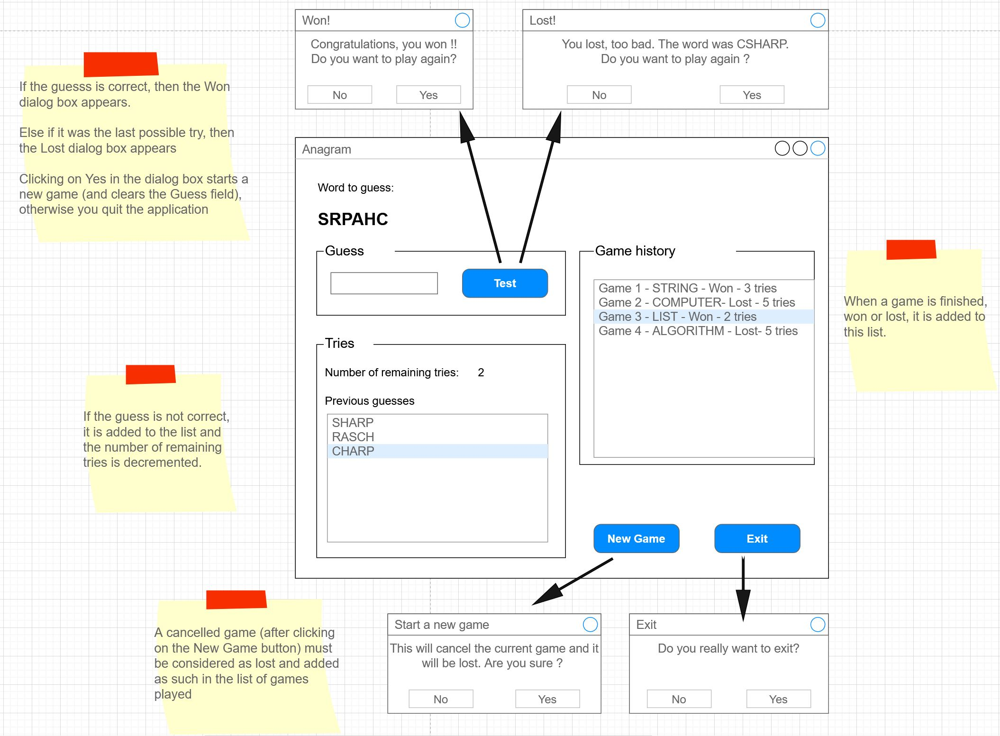
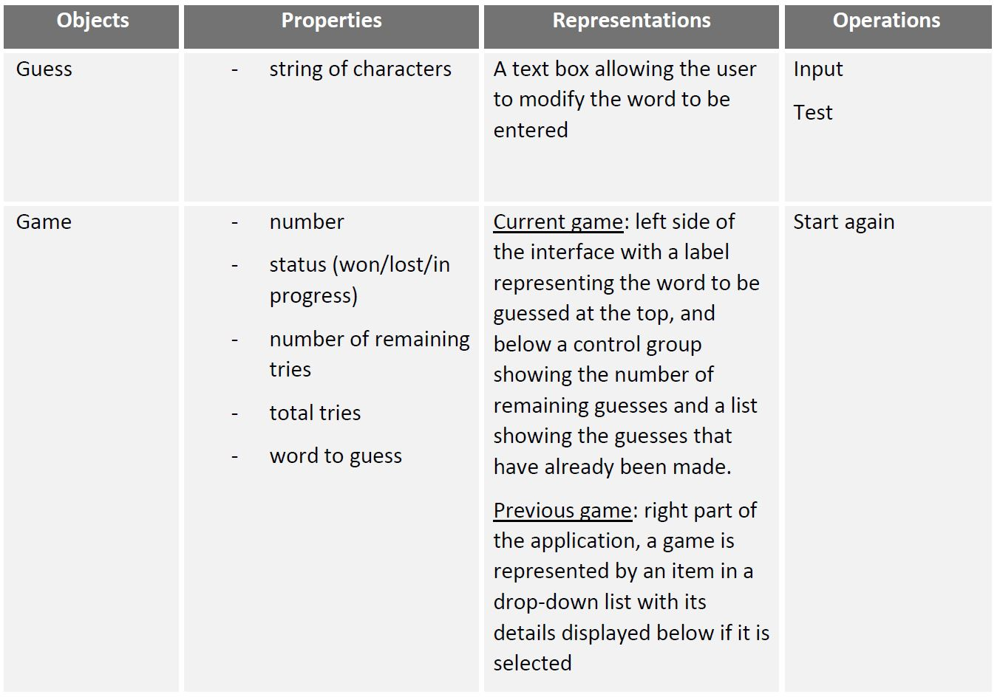
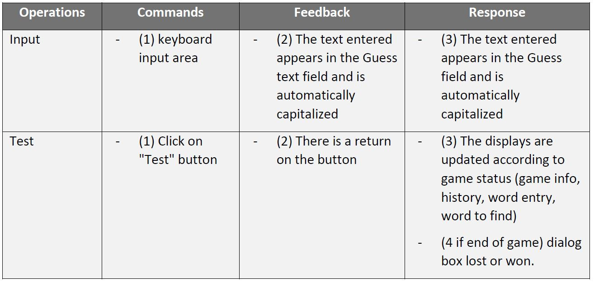
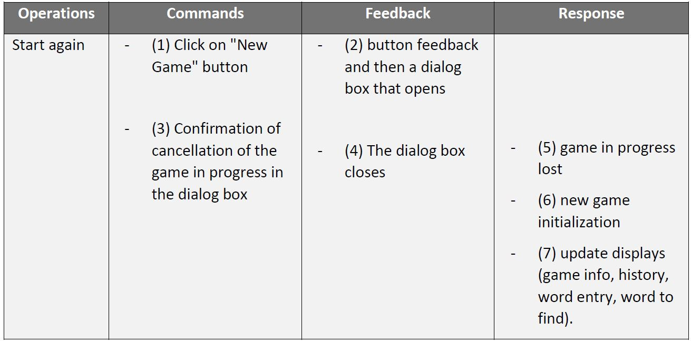
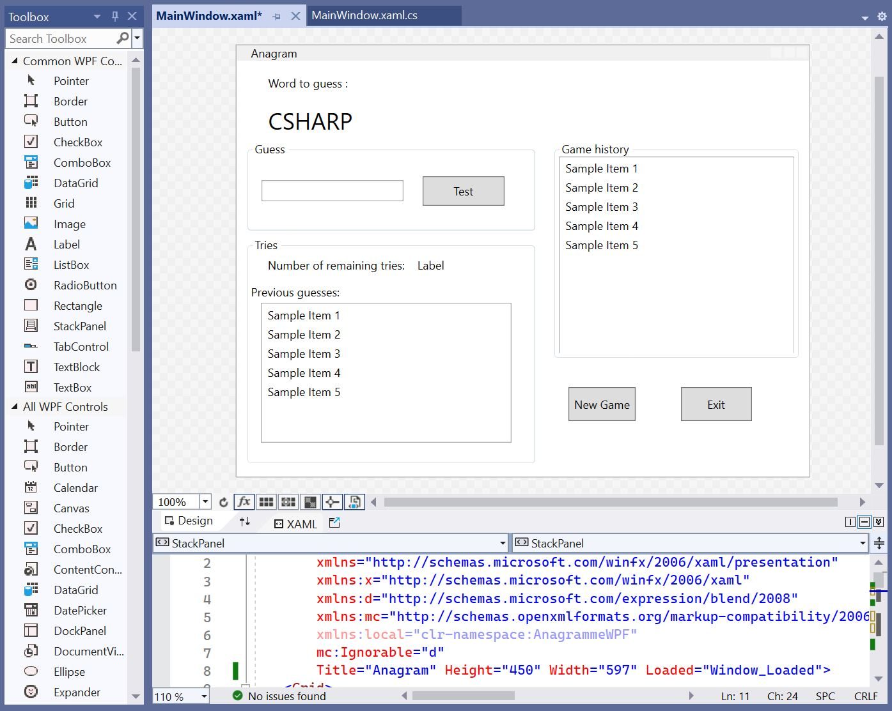
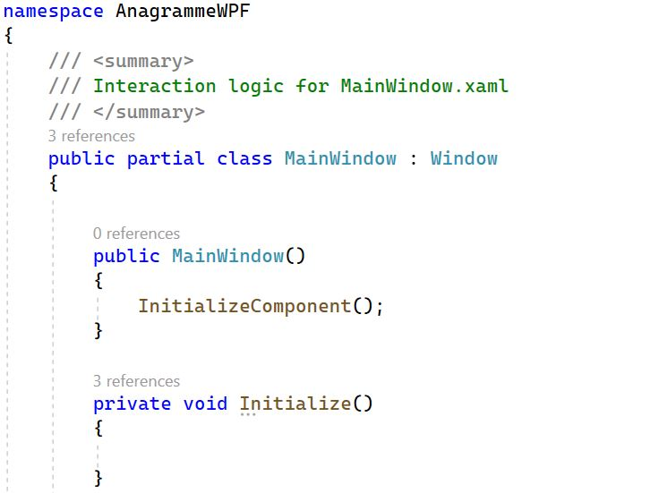
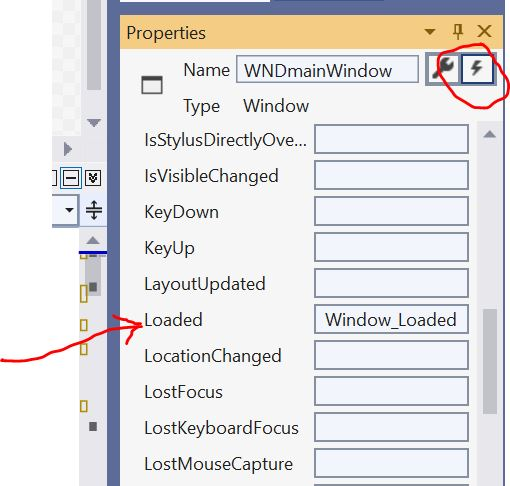
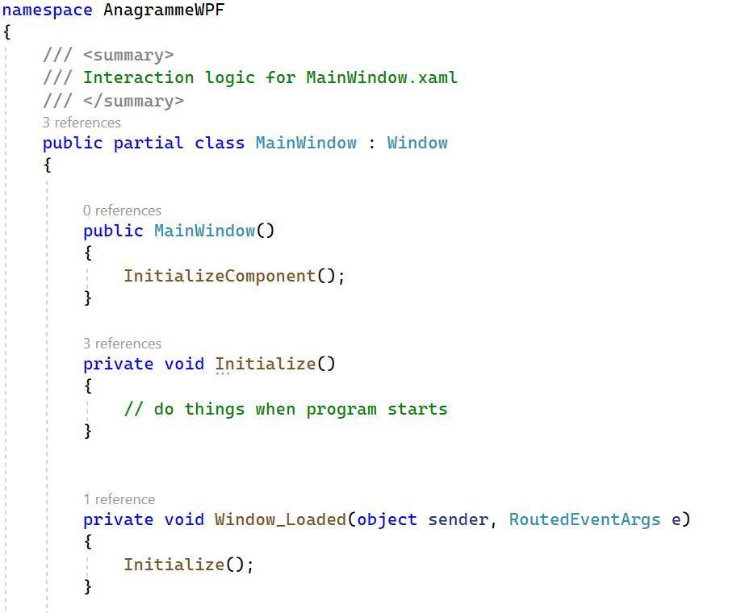
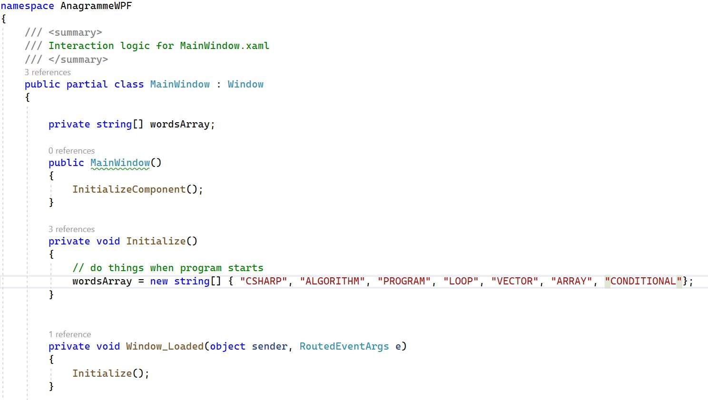
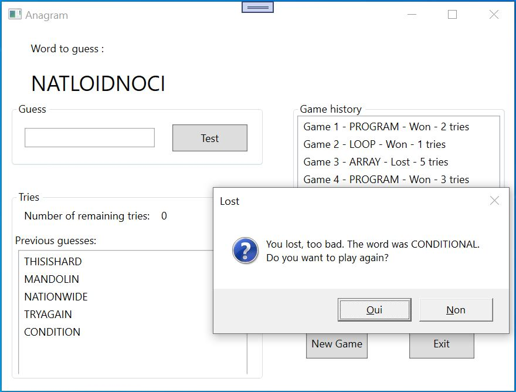

# Lab4 - Anagram

In this lab, we'll be using some of the more advanced features and controls of C# and WPF.

## Work to hand in
At the end of the two sessions (a total of 4 hours' work), you'll be asked to submit your project using **travo**.

## The topic
Sometimes in life you get bored. And I'm not talking about HMI lectures, which are fascinating most of the time. But when there's really nothing to stimulate the few neurons we have left, playing a little game can give us a taste of intellectual stimulation.

That's why we're asking you to create an anagram game in WPF!

Here's a mockup of what we should have:



The expected functionalities are :
- The user can play a game of Anagram, where he or she must find the word hidden behind the jumbled word.
    - They can suggest answers.
    - They can consult/view previous suggestions.
    - There's a limited number of tries per game.
- If the word is found, the game is won (corresponding MessageBox).
- If the word is not found after all tries, the game is lost (corresponding MessageBox).
- The user can start a new game at any time, but the game in progress is considered lost.
- At the end of a game that is won or lost, the system uses a MessageBox to ask the user if he/she wishes to play again.
- The system keeps a game history.

Here is the functional table for the objects of this application:



Here's the operations functional table for the **guess** object: 



And here's the operations functional table for the **game** object: 



## (1) Retrieve the project using **travo**
<details>
    <summary>See instructions here to retrieve and submit the project (important).</summary> 

> To retrieve the project and submit it at the end of the two sessions, you'll need to use the **travo** script provided by the teacher responsable for this course. Download this script [**travoIHM.py**](https://ihm.gitpages.iut-orsay.fr/cours/travoIHM.py) to your personal space (somewhere in drive Z:).
> 
> **travo** is a set of Python scripts maintained by teachers & researchers from Paris-Saclay and Quebec, making it easier for teachers to use GIT. In fact, **travo** commands perform a set of GIT commands for you. Both **travo** and Python are already installed on IUT computers.
> > 
> > You can use your own computer and install **travo** on it (provided you've installed Python beforehand, of course) using the command
> > ```
> > pip install travo
> > ```
> 
> On the IUT computer, go to the C:WinPython directory and run the "WinPython Powershell Prompt.exe" program. A Powershell terminal will open, ready to receive Python commands.
> Inside this PowerShell terminal, first type the following command, enabling you to move to > your personal space:
> 
> ```
> cd Z:\
> ```
> 
> If you type the **ls** command, you should see the **travoIHM.py** script you downloaded earlier in the list of files in this directory (of course, you can work in a directory other than the root of the Z: directory).
> 
> Finally, to retrieve the project, simply type the command :
> 
> ```
> python travoIHM.py fetch tpihm2
> ```
> 
> You will be asked for your ADONIS (IUT) login information, and the project will be downloaded to your computer (in the "tpihm2" directory). If an authentication window opens after you've already entered your information in the Powershell terminal, you can close it.
> 
> Save or submit your work to your teacher with the command : 
> ```
> python travoIHM.py submit tpihm2 ####
> ```
> You need to replace #### with your group ID **tp2a** or **tp2b** etc... Don't enter the wrong group, you'll lose points (if you've made a mistake, you can resubmit with the correct group and travo will correct the error, so don't panic).
> 
> You can submit as many times as you like. It's good practice not to lose your work.
>
> > ### Add a file to a project that has been retrieved
> > 
> > Most of the projects you'll retrieve with travo will contain all the files you need. However, you may need to add files (images, sounds, classes, etc.) to your projects, so that they can be found on the Git.
> > 
> > **travo** doesn't check for new files in your projects.
> > 
> > However, you can use the **git add** commands that you should have seen in [Qualité de développement](https://hoangla95.github.io/qualitedevs2/tp1) by placing yourself in the project directory.
> >
> > Once the files have been added with the **git add** command, travo will take them into account during **submit**.

</details>

# Using the documentation

To program this application correctly, you'll need to use various functions in the C# language.

Go to the [Microsoft C#](https://learn.microsoft.com/fr-fr/dotnet/csharp/) documentation to find out how to:
- Generate random numbers using the "Random" class and the "Next" method.
- Insert a character into a string at a given position.
- Convert a string to uppercase (and lowercase) characters.
- Obtain the length of a string or the size of an array.
- Use a TextBox  property (find which one) to force characters into uppercase.
- Add items to a ListBox and empty a ListBox.

# Programming the application 

## Graphic design

Start by creating the application's graphical appearance by placing the right controls in the Designer (you can also use the XAML editor, which is synchronized with the Graphical Designer - the two can and should be used in conjunction).



{-Careful, lists of elements are ListBoxes, and panels with a border and title (and which allow controls to be grouped together) are GroupBoxes-}

## C# Code

The words to be found will be stored **in uppercase** in an array of strings. This array is a private attribute of your class:

```
private String[] wordsArray; 
```
As you'll see below, this array will be initialized at application startup with a collection of words to find. Each word will then be "jumbled" before being displayed in the appropriate Label. Words entered by the player will be converted to uppercase immediately on entry, to avoid case problems. The user will be allowed a maximum number of tries.

You'll probably need other private attributes (to keep track of the number of tries remaining, the word drawn at random at the start of a game, etc.). You'll add them later, as you program your game.

Programming is divided into 3 parts. Parts A and B concern the left-hand side of the application, the heart of the game, while part C concerns the right-hand side, the game history.

### Part 1

First, you need to define and write in your code the 5 procedures and functions mentioned below, which will be required for your application. Note that these procedures are not event-driven procedures, but they will be called by event-driven procedures. 
You can write them in the same place as the event-driven procedures (in the .cs file). Here's an example for the initialization() procedure:

<table><tr><td> 
    
</td></tr></table>

I'd like to take this opportunity to remind you that when a window is loaded for the first time, it launches a **Loaded** event. An event-driven procedure that reacts to this event is therefore the perfect place to write code that needs to be launched only once when the application is started. Consult the events available for the window in the Properties/Events view, and add the event-driven procedure by double-clicking in its text field: 



<table><tr><td>
    
</td></tr></table>


Test each procedure/function you write and make sure it works before moving on to the next one (to do this, you can add a temporary **Test** button whose click event procedure can be used to call the procedure to be tested, or you can call them in the event procedure that reacts to the **Loaded**).

And don't forget to comment your code :wink: 

1.	Write the **private void Initialize()** procedure, which performs the initializations to be carried out when the application is launched. For the moment, this is limited to initializing the word array. Note that this procedure will only be called once, and should not be confused with the newGame() procedure, which will be called several times (see below). 

Think carefully about the declaration of your variables: if they will be used in several procedures, then declare them globally, as class attributes; otherwise, declare them locally in the procedure concerned.
I'll be helpful and show you what this first procedure might look like (see also where the word array is declared):

<table><tr><td>
    
</td></tr></table>

2.	Write a function **private String Jumble(String word)** which, given a string parameter as input, returns a new string resulting from a random permutation of its letters. To achieve this, the following algorithm is suggested: for each character of the initial string, insert them one by one into a new string (initially empty) at a random position (between the first and last position included!!).

3.	Write a procedure **private void NewGame()** that resets the state of the game to zero, i.e. that performs the initializations to be carried out for each new game, when a new word has to be found. For the moment, this is limited to drawing a word at random from the wordsArray, jumbling its letters (use the jumble function) and displaying it in the user interface.

4.	Write a procedure **private void CorrectWord()** which performs the necessary tasks if the player has won. For now, this is limited to asking them if they want to play again.

5.	Write a procedure **private void IncorrectWord()** which performs the necessary tasks if the word proposed by the player is incorrect. If there are no tries left, then the game is lost: the word to be found is displayed and the player is asked if they want to play again. If there are tries left, then nothing happens and the game continues (the player can suggest a new word). You'll need to declare variables somewhere to store the maximum number of tries and the number of remaining tries. You'll also need to update the display in the lower part of the application (the tries panel, bottom left of the mockup).

### Part 2

Now write your application's event-driven procedures to call the 5 preceding procedures/functions at the right place. You may need to add statements to these procedures depending on your way of doing things.

### Part 3

Finalize the various procedures and functions in order to display, on the right-hand side of the application, for each game played, whether the player won (with how many tries) or lost and what the word to find was. You just have to add a line of text to the ListBox's **Items**.



## Optional extensions and enhancements

You can adapt and improve the interface to make it more attractive (colors, layout of controls, animations etc.) to add more functionalities (without reducing usability!!!). For example, you can prevent the user from clicking on the Test button if no word has been entered, empty the Textbox after each try, allow the word array to be initialized with words entered by the user, allow the number of possible tries to be changed, propose a more advanced score and display, and so on.

### Submit your work
Don't forget to submit your work to your teacher with the **travo** command:  
```
python travoIHM.py submit tpihm4 ####
```
replacing #### with your group ID **tp2a** or **tp2b**  etc... Once again, don't get the wrong group...

