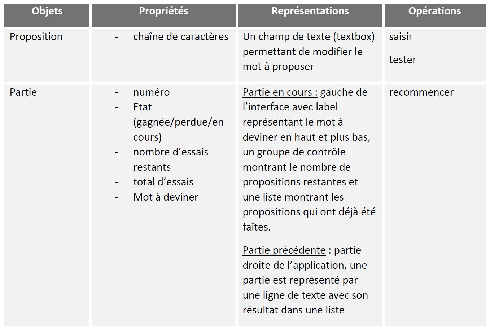
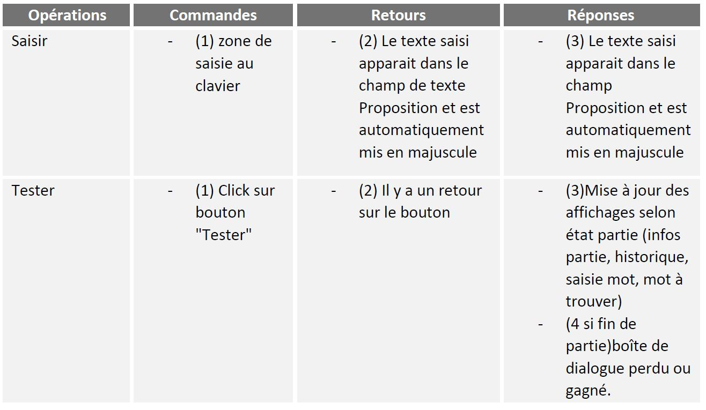
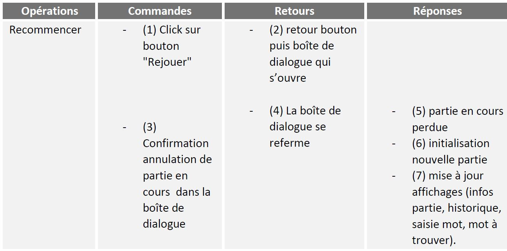
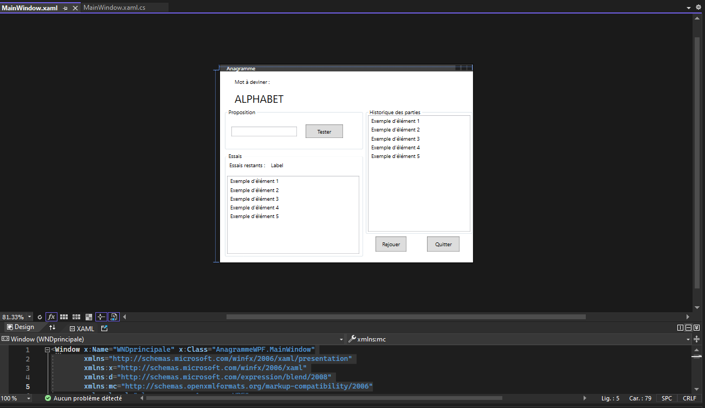
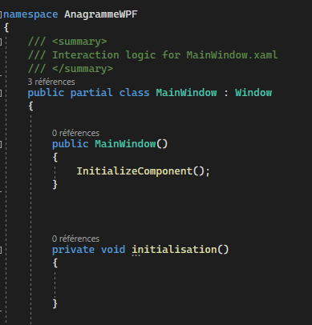
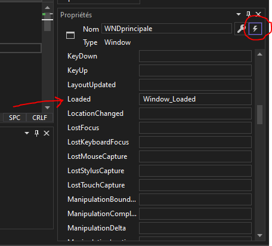
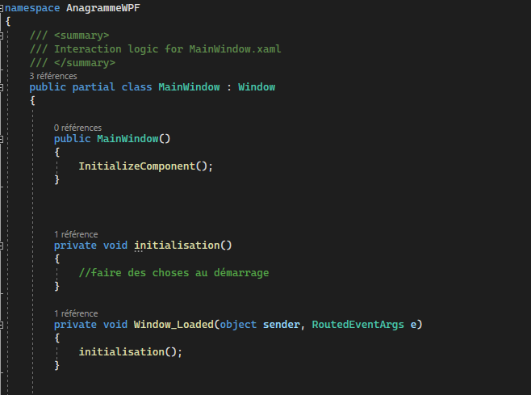
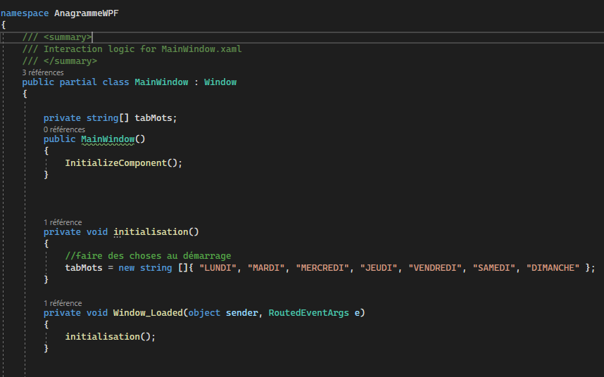
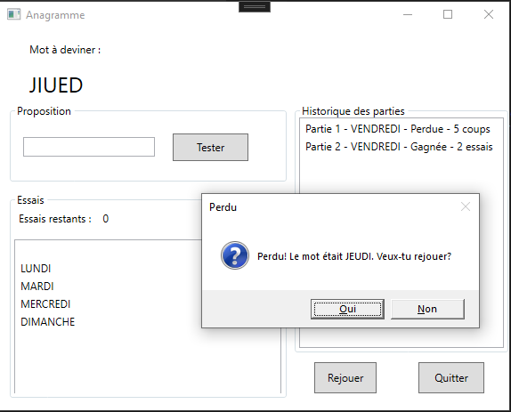

# TPIHM4 - Anagramme 

Dans ce TP, nous allons utiliser des fonctionnalités  et des contrôles un peu plus avancées du C# et de WPF

## Travail à rendre
A la fin des deux séances (un total de 4 heures de travail), vous devrez soumettre votre projet à l'aide de travo.

## Le sujet
Parfois dans la vie on s'ennuie. Et je ne parle pas des amphis d'IHM, qui sont passionants la plupart du temps. Mais quand vraiment plus rien ne vient faire vibrer les quelques neurones qu'il nous reste, jouer à un petit jeu peut permettre de retrouver le goût de la stimulation intellectuelle.

C'est pourquoi nous vous demandons de réaliser un jeu d'anagramme en WPF!

Voici la maquette de ce que nous devrions avoir :


Les fonctionnalités attendues sont :
- L'utilisateur peut jouer une partie d'Anagramme, où il faut retrouver le mot qui se cache derrière le mot mélangé
    - Il peut faire des propositions de réponses
    - Il peut consulter / visualiser les propositions précédentes
    - Il a un nombre limité de tentatives pour une partie
- Si le mot est trouvé, la partie est gagnée (MessageBox correspondante)
- Si le mot n'est pas trouvé à l'issu des tentatives, la partie est perdue (MessageBox correspondante)
- L'utilisateur peut relancer une nouvelle partie à tout moment, la partie en cours est considérée perdue
- A la fin d'une partie Gagnée ou Perdue, le système demande à l'aide d'un MessageBox à l'utilisateur s'il souhaite refaire une partie
- Le système conserve l'historique des parties

Voici la table fonctionnelle des objets de cette application :



Voici la table fonctionnelle des opérations pour l’objet **proposition** : 



Voici la table fonctionnelle des opérations pour l’objet **partie** : 



## (1) Récupérer le projet à l'aide de **travo**
<details>
  <summary>Voir les instructions pour récupérer et soumettre le projet (*important*)</summary> 

> Pour récupérer le projet et le soumettre à la fin des deux séances, vous allez devoir utiliser le script **travo** fourni par le responsable du module. Télécharger ce script [**travoIHM.py**](https://ihm.gitpages.iut-orsay.fr/cours/travoIHM.py) dans votre espace personnel (quelque part dans le lecteur Z:).
> 
> > **travo** est un ensemble de scripts Python maintenu par des enseignants chercheurs de Paris-Saclay et du Québec facilitant l'utilisation de GIT pour les enseignants. En fait les commandes **travo** effectuent un ensemble de commande GIT pour vous. **travo** ainsi que Python sont déjà installés sur les ordinateurs de l'IUT.
> > 
> > Vous pouvez utiliser votre propre ordinateur et installer **travo** dessus (à condition d'avoir installé Python au préalable bien sûr) à l'aide de la commande: 
> > ```
> > pip install travo
> > ```
> 
> Sur l'ordinateur de l'IUT, rendez-vous dans le répertoire C:\WinPython et lancer le programme "WinPython Powershell Prompt.exe", un terminal Powershell va s'ouvrir, prêt à recevoir des commandes Python.
> A l'intérieur de ce terminal PowerShell, tapez d'abord la commande suivante, vous permettant de vous déplacer dans > votre espace personnel :
> 
> ```
> cd Z:\
> ```
> 
> Si vous tapez la commande **ls**, vous devriez voir dans la liste des fichiers de ce répertoire, le script **travoIHM.py** que vous avez téléchargé précédemment (bien sûr, vous pouvez travailler dans un autre répertoire que la racine du répertoire Z:).
> 
> Enfin, pour récupérer le projet, il vous suffit de taper la commande :
> 
> ```
> python travoIHM.py fetch tpihm4
> ```
> 
> Il vous sera demandé vos identifiants ADONIS (de l'IUT) puis le projet sera téléchargé sur votre ordinateur (dans le répertoire "tpihm4"). 
> 
> Sauvegarder ou soumettre votre travail à l'enseignant se fera à l'aide de la commande : 
> ```
> python travoIHM.py submit tpihm4 ####
> ```
> Il vous faut remplacer #### par votre identifiant de groupe **tp2a** ou **tp2b** etc... Ne vous trompez pas de groupe, ce sera des points en moins
> 
> Vous pouvez faire autant de "submit" que vous voulez. C'est une bonne pratique pour ne pas perdre votre travail.
>
> > ### Ajouter un fichier à un projet récupéré
> > 
> > La plupart des projets que vous allez récupérer avec travo contient a priori tous les fichiers dont vous avez besoin. Cependant il est possible que vous ayez besoin d'ajouter des fichiers (des images, des sons, des classes, que sais-je...) à vos projets, afin qu'ils se retrouvent sur le Git.
> > 
> > **travo** ne regarde pas s'il y a de nouveaux fichiers dans vos projets.
> > 
> > Cependant, vous pouvez tout à fait utiliser les commandes **git add** que vous avez dû voir en cours de [Qualité de développement](https://hoangla95.github.io/qualitedevs2/tp1) en vous plaçant dans le répertoire du projet.
> >
> > Une fois les fichiers ajoutés avec la commande **git add**, travo les prendra en compte lors du **submit**.

</details>

# Utilisation de la documentation

Afin de correcter programmer cette application, vous allez avoir besoin d'utiliser différentes fonctions du langage C#.

Rendez vous sur la documentation [C# de Microsoft](https://learn.microsoft.com/fr-fr/dotnet/csharp/) afin de comprendre comment fonctionne :
- La génération de nombres aléatoires avec la classe "Random" et l'utilisation de la méthode "Next"
- Insérer un caractère dans une chaîne de caractères à une position donnée
- Convertir une chaîne de caractères en majuscules (et en minuscules)
- Obtenir la longueur d'une chaîne de caractères ou de la taille d'un tableau
- Quelle propriété du contrôle TextBox permet de forcer les caractères en majuscule?
- Comment ajouter des éléments à une ListBox et comment vider une ListBox?

N'hésite pas à déjà créer ton projet dans Visual Studio afin de tester le code dans une application et comprendre comment il fonctionne, fais des essais, c’est comme ça qu’on apprend !

# Programmation de l'application

## Conception graphique

Commencez par réaliser l'aspect graphique de l'application en plaçant les bons contrôles dans le Designer (vous pouvez aussi vous aider de l'éditeur XAML qui est synchronisé avec le Designer graphique, les deux peuvent et doivent s'utiliser conjointement).



 [- Attention, les listes d'éléments sont des **ListBox**, et les panels avec une bordure et un titre (et qui permettent de regrouper des contrôles ensembles) sont des **GroupBox** -]

## Code C#

Les mots à trouver seront stockés **en majuscules** dans un tableau de chaînes de caractères. Ce tableau est un attribut privé de votre classe :

```
private String[] tabMots; 
```
Comme vous le verrez plus loin, ce tableau sera initialisé au démarrage de l'application avec une collection de mots à trouver. Chaque mot sera ensuite "mélangé" avant d'être affiché dans le Label adéquat. Les mots saisis par le joueur seront convertis en majuscules, immédiatement lors de la saisie, pour éviter les problèmes de casse. L'utilisateur aura droit à un nombre maximum d'essais.

Vous aurez surement besoin d'autres attributs privés (pour conserver le nombre d'essais restants, le mot pioché au hasard au début d'une partie etc...). Vous les ajouterez au fur et à mesure de la programmation de votre jeu.

La programmation est divisée en 3 parties. La partie A et la partie B du travail concernent la partie gauche de l’application, le cœur du jeu, alors que la partie C concerne la partie droite, l’historique des parties.

### Partie 1

Dans un premier temps il t’est demandé de définir et d’écrire dans ton code les 5 procédures et fonctions mentionnées plus loin, qui seront nécessaires pour ton application. Attention, ces procédures ne sont pas les procédures événementielles, mais elles seront appelées par les procédures événementielles. 
Tu peux les écrire au même endroit où s’écrivent les procédures événementielles (dans le fichier .cs), voici un exemple pour la procédure initialisation() :



J’en profite pour te rappeler que lorsque qu’une fenêtre est chargée pour la première fois, celle-ci lance un événement **Loaded**. Une procédure événementielle qui réagit à cet événement est donc l’endroit parfait pour écrire du code qui doit être lancé une seule fois au démarrage de l’application. Consulte les événements disponibles pour la fenêtre dans la vue Propriétés/Evenements, et ajoute la procédure évenementielle en double-cliquant dans le champ texte de celui-ci : 




Teste chacune des procédures/fonctions que tu écris et assure toi qu’elle fonctionne avant de passer à la suivante (pour ceci, tu peux ajouter un bouton temporaire **Test** dont le seul but de sa procédure événementielle est d'appeler la procédure à tester ou alors tu peux les appeler dans la procédure événementielle qui réagit au **Loaded**).

Et n’oublie pas de commenter ton code :wink: 

1.	Écrire la procédure **private void initialisation()** qui réalise les initialisations à effectuer au lancement de l'application. Pour le moment, ceci se limite à l’initialisation du tableau de mots. Attention : cette procédure ne sera appelée qu'une seule fois et ne doit pas être confondue avec la procédure nouvellePartie() qui elle sera appelée plusieurs fois (voir plus loin). 
Bien réfléchir à la déclaration de vos variables : si elles seront utilisées dans plusieurs procédures, alors les déclarer globalement, en attributs de classe, sinon, les déclarer localement à la procédure concernée.
Allez, je suis sympa, je te montre à quoi ça pourrait ressembler pour cette première procédure (regarde également où est déclaré le tableau de mots) :



2.	Écrire une fonction **private String melanger(String chaine)** qui, à partir d'un paramètre chaîne en entrée, renvoie une nouvelle chaîne résultant d'un mélange aléatoire de ses lettres. Pour réaliser ce mélange, l'algorithme suivant vous est proposé : pour chaque caractère de la chaîne initiale, les insérer un par un dans une nouvelle chaîne (initialement vide) à une position aléatoire (entre la première et la dernière position inclues !!).

3.	Écrire une procédure **private void nouvellePartie()** qui remet à zéro l'état du jeu, c'est à dire qui réalise les initialisations à effectuer à chaque nouvelle partie, c'est-à-dire, pour chaque nouveau mot à trouver. Pour le moment, ceci se limite à effectuer le tirage aléatoire d'un mot dans le tableau tabMots, le mélange de ses lettres (grâce à la fonction melanger) et son affichage dans l’interface utilisateur.

4.	Écrire la procédure **private void motCorrect()** qui réalise les tâches nécessaires si le joueur a gagné. Pour le moment, ceci se limite à lui demander s'il veut rejouer.

5.	Écrire la procédure **private void motIncorrect()** qui réalise les tâches nécessaires si le mot proposé par le joueur n'est pas le bon. S'il ne lui reste plus d'essais, alors il a perdu : on lui affiche le mot qui était à trouver et on lui demande s'il veut rejouer. S'il reste des essais, alors il ne se passe rien et le jeu continue (le joueur peut proposer un nouveau mot). Cela veut dire que vous aurez besoin de déclarer quelque part des variables permettant de stocker le nombre d’essais maximal ainsi que le nombre d’essais restants. Il faudra également gérer la mise à jour de l’affichage dans la partie basse de l’application (le cadre Essais, en bas à gauche de la maquette).

### Partie 2

Ecris maintenant les procédures événementielles de ton application afin d’appeler au bon moment les 5 procédures/fonctions précédentes. Il se peut que tu aies besoin de compléter les procédures précédentes selon ta façon de faire.

### Partie 3

Complète les différentes procédures et fonctions afin de pouvoir afficher, dans la partie droite de l’application, pour chaque partie jouée, si le joueur a gagné (en combien de coups) ou perdu et quel était le mot à trouver. Il te suffit pour cela d’ajouter une ligne de texte dans les **Items** de la ListBox.



## Extensions et améliorations facultatives

Tu peux adapter et améliorer l’interface proposée pour la rendre plus attrayante (couleurs, disposition des contrôles, animations etc.) mais aussi y apporter plus de fonctionnalités (sans pour autant en réduire l’utilisabilité !!!). Par exemple, tu peux empêcher l’utilisateur de cliquer sur le bouton Tester s’il n’a pas saisi de mot, vider la Textbox après chaque essai, permettre d’initialiser le tableau de mots avec des mots saisis par l’utilisateur, permettre de changer le nombre de tentatives, proposer un score et un affichage plus avancés, etc.


## Remettre ton travail
N'oublie pas de soumettre ton travail à l'enseignant avec la commande **travo** 
```
python travoIHM.py submit tpihm4 ####
```
> en remplaçant #### par ton identifiant de groupe **tp2a** ou **tp2b** etc... Encore une fois, ne te trompe pas de groupe...
