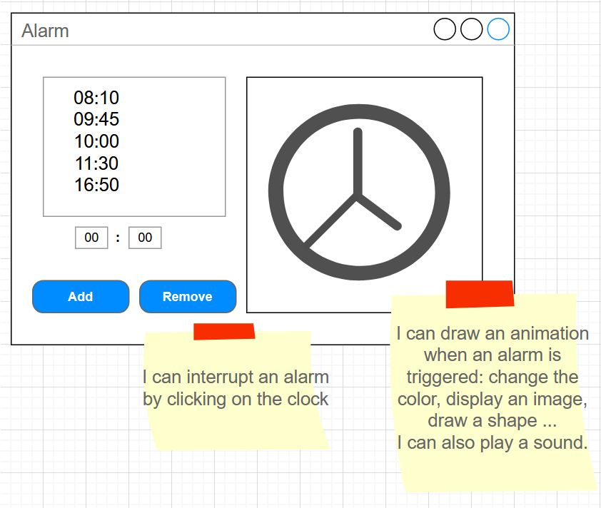
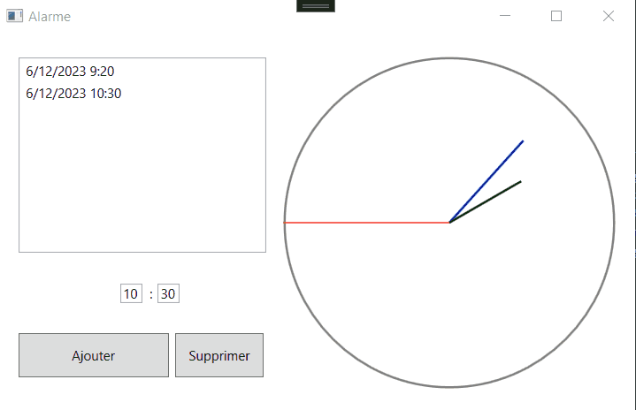

# Lab5 - Alarm Clock

In this lab, we'll develop a more visual and interactive application using WPF's graphical features and a timer.

## Work to hand in
At the end of the two sessions (a total of 4 hours' work), you'll be asked to submit your project using **travo**.

## The topic
If there's one thing students hate in life, it's being late for their HMI class. To alleviate this problem, the IUT management has asked you to create a clock application for setting alarms.

Here's a mock-up of what we should have:



The expected functionalities are as follows:
- Display the time :wink:
- Display a list of alarms (times, with ou without a date).
- Add and delete an alarm.
    - To delete an alarm, it must be selected in the list.
- Draw a clock and its 3 hands using WPF drawing methods to display the time in real time.
- Automatically trigger a visual signal (a color change) or sound (play a sound) when the time is that of one of the alarms in the list.
- Interrupt the alarm (visual or sound signal) to return the application to its normal state.
- Add your personal touch.

## (1) Retrieve the project using **travo**
<details>
    <summary>See instructions here to retrieve and submit the project (important).</summary> 

> To retrieve the project and submit it at the end of the two sessions, you'll need to use the **travo** script provided by the teacher responsable for this course. Download this script [**travoIHM.py**](https://ihm.gitpages.iut-orsay.fr/cours/travoIHM.py) to your personal space (somewhere in drive Z:).
> 
> **travo** is a set of Python scripts maintained by teachers & researchers from Paris-Saclay and Quebec, making it easier for teachers to use GIT. In fact, **travo** commands perform a set of GIT commands for you. Both **travo** and Python are already installed on IUT computers.
> > 
> > You can use your own computer and install **travo** on it (provided you've installed Python beforehand, of course) using the command
> > ```
> > pip install travo
> > ```
> 
> On the IUT computer, go to the C:WinPython directory and run the "WinPython Powershell Prompt.exe" program. A Powershell terminal will open, ready to receive Python commands.
> Inside this PowerShell terminal, first type the following command, enabling you to move to > your personal space:
> 
> ```
> cd Z:\
> ```
> 
> If you type the **ls** command, you should see the **travoIHM.py** script you downloaded earlier in the list of files in this directory (of course, you can work in a directory other than the root of the Z: directory).
> 
> To retrieve the project, simply type the command :
> 
> ```
> python travoIHM.py fetch tpihm5
> ```
> 
> You will be asked for your ADONIS (IUT) login information, and the project will be downloaded to your computer (in the "tpihm2" directory). If an authentication window opens after you've already entered your information in the Powershell terminal, you can close it.
> 
> Saving or submitting your work to your teacher will be done with the command : 
> ```
> python travoIHM.py submit tpihm5 ####
> ```
> You need to replace #### with your group ID **tp2a** or **tp2b** etc... Don't enter the wrong group, you'll lose points (if you've made a mistake, you can resubmit with the correct group and travo will correct the error, so don't panic).
> 
> You can submit as many times as you like. It's good practice not to lose your work.
>
> > ### Add a file to a project that has been retrieved
> > 
> > Most of the projects you'll retrieve with travo will contain all the files you need. However, you may need to add files (images, sounds, classes, etc.) to your projects, so that they can be found on the Git.
> > 
> > **travo** doesn't check for new files in your projects.
> > 
> > However, you can use the **git add** commands that you should have seen in [Qualité de développement](https://hoangla95.github.io/qualitedevs2/tp1) by placing yourself in the project directory.
> >
> > Once the files have been added with the **git add** command, travo will take them into account during **submit**.

</details>

### Adding a Timer

To add a Timer to your application, you need to do so from within the C# code. You can start by declaring an attribute of type "DispatcherTimer" in your class:
```
 DispatcherTimer timer;
```

And then, in your initialization method (for example, the event procedure associated with the window's "Loaded" event), you can initialize your timer: 
```
timer = new DispatcherTimer();
//Defines the number of seconds between each triggering of the Tick event 
timer.Interval = TimeSpan.FromSeconds(1);
//Associates an event procedure with the timer's Tick event, you'll need to write this event procedure.
timer.Tick += timer_Tick;
//Launches the timer, otherwise nothing happens
timer.Start();
```

It is in the "timer_Tick" event procedure code that you will change the coordinates of the clock hands and check whether an alarm should be triggered.

### Drawing the clock
To draw the clock correctly, we're going to need to use a little trigonometry!

First of all, you'll need to declare attributes for each part of the drawing (you could do it differently, of course):
```
//A circle
private Ellipse ellipse;
//3 hands
private Line minutes;
private Line hours;
private Line seconds;
```

In WPF, drawing elements (lines, circles) are added to the interface as controls. So we need a place in the interface to add these elements. In XAML, add a Canvas control (preferably 300x300 in size, for example) that will serve as the drawing area for the clock. Change the Name property of this Canvas to "CNVClock". Now, from the C# code, we can access it.

In your initialization method (for example, the event procedure associated with the window's "Loaded" event), you can initialize the drawing elements and add them to your Canvas. Here, I'll just show you how to initialize the circle and the seconds hand (you'll need to do this for the other two hands, of course). The circle here is the same size as the Canvas, which suits us fine:
```
ellipse = new Ellipse();
CNVClock.Children.Add(ellipse);
ellipse.Width = 300;
ellipse.Height = 300;
ellipse.Stroke = Brushes.Gray; 
ellipse.StrokeThickness = 1;
```
For the clock hands, we need to define the line origin (X1,Y1) and end point (X2,Y2).

```
seconds = new Line();
CNVClock.Children.Add(seconds);
seconds.Stroke = Brushes.Red; 
seconds.StrokeThickness = 1;
//The point of origin is at the center of the circle
seconds.X1 = ellipse.Width / 2;
seconds.Y1 = ellipse.Height / 2;
```

For the end point, we're going to need a bit of trigonometry!
For this, we're going to use C#'s mathematical functions, in particular "Math.PI" (which gives the value of π) and "Math.Cos" and "Math.Sin", which calculate the cosine and sine of a given angle in radians.

The method consists in calculating the "x" and "y" coordinates of this end point as a function of the angle the hand should have. The "x" corresponds to the cosine of the angle expressed in radians, the "y" corresponds to the sine of the angle expressed in radians, quite simply.
So we need the angle in radians and we're done!

How do I find it?

If I were to transpose the circle of my clock to the trigonometric circle I would have :
- When the hand points to 3 o'clock, the angle is 0 radians.
- When the hand points to 12 o'clock, the angle is π/2 radians
- When the hand points at 9 o'clock, the angle is π radians
- When the seconds hand points to n seconds, then the angle is π/2-(n * π/30) radians
- etc...


I'll give you the code for the seconds hand. As you copy and paste it in the right place, try to understand it. You'll also need to do this for the minutes and hours. Note that the values in the trigonometric equation may be different for the other hands. 

As I said earlier, when the seconds hand points to n seconds, then the angle is not just n * π/30 but π/2-(n * π/30) radians (this is because the origin of the circle is on the right and the direction of rotation is opposite to the direction of the hands). Feel free to draw a picture to understand.

Finally, the radius of the trigonometric circle is 1. But the length of the hands can be different. That's why, at the end, I multiply the distance obtained between 0 and 1 on the trigonometric circle by the length I want for my hand in my clock circle (here, ellipse.Width/2). 

```
//I define the length of the hand, I could set another value
double lengthSecondsHand = ellipse.Width/2; 
seconds.X2 = ellipse.Width / 2 + Math.Cos(15 * Math.PI / 30 - DateTime.Now.Second * Math.PI / 30) * lengthSecondsHand;
seconds.Y2 = ellipse.Height / 2 + Math.Sin(-15 * Math.PI / 30 + DateTime.Now.Second * Math.PI / 30) * lengthSecondsHand;
```




### Submit your work
Don't forget to submit your work to your teacher with the **travo** command. 
```
python travoIHM.py submit tpihm5 ####
```
replacing #### with your group ID **tp2a** or **tp2b** etc... Once again, don't get the wrong group...