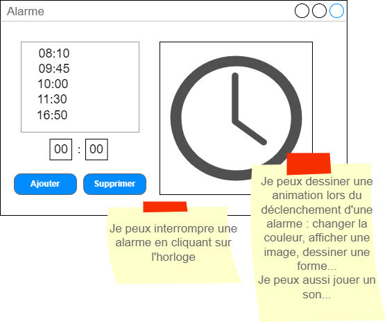

# TPIHM5 - Alarme

Dans ce TP, nous allons développer une application un peu plus visuelle et interactive à l'aide des fonctionnalités graphiques de WPF et de l'utilisation d'un timer.

## Travail à rendre
A la fin des deux séances (un total de 4 heures de travail), vous devrez soumettre votre projet à l'aide de travo.

## Le sujet
S'il y a bien une chose que les étudiants détestent dans la vie, c'est d'arriver en retard en cours d'IHM. Afin de pallier à ce problème, la direction de l'IUT vous demande de réaliser une application horloge permettant de configurer des alarmes.

Voici la maquette de ce que nous devrions avoir :



Les fonctionnalités attendues sont les suivantes :
- Afficher l'heure :wink:
- Afficher une liste des alarmes (l'heure, avec ou sans la date)
- Ajouter et supprimer une alarme
  - Pour supprimer une alarme, il faudra l'avoir sélectionnée dans la liste 
- Dessiner une horloge et ses 3 aiguilles à l'aide des méthodes de dessin de WPF pour afficher l'heure en temps réel.
- Déclencher automatiquement un signal visuel (un changement de couleur) ou sonore (jouer un son) lorsque l'heure est celle d'une des alarmes de la liste.
- Interrompre l'alarme (le signal visual ou sonore) pour remettre l'application dans son état normal
- Ajouter votre touche personnelle

## (1) Récupérer le projet à l'aide de **travo**
<details>
  <summary>Voir les instructions pour récupérer et soumettre le projet (*important*)</summary> 

> Pour récupérer le projet et le soumettre à la fin des deux séances, vous allez devoir utiliser le script **travo** fourni par le responsable du module. Télécharger ce script [**travoIHM.py**](https://ihm.gitpages.iut-orsay.fr/cours/travoIHM.py) dans votre espace personnel (quelque part dans le lecteur Z:).
> 
> > **travo** est un ensemble de scripts Python maintenu par des enseignants chercheurs de Paris-Saclay et du Québec facilitant l'utilisation de GIT pour les enseignants. En fait les commandes **travo** effectuent un ensemble de commande GIT pour vous. **travo** ainsi que Python sont déjà installés sur les ordinateurs de l'IUT.
> > 
> > Vous pouvez utiliser votre propre ordinateur et installer **travo** dessus (à condition d'avoir installé Python au préalable bien sûr) à l'aide de la commande: 
> > ```
> > pip install travo
> > ```
> 
> Sur l'ordinateur de l'IUT, rendez-vous dans le répertoire C:\WinPython et lancer le programme "WinPython Powershell Prompt.exe", un terminal Powershell va s'ouvrir, prêt à recevoir des commandes Python.
> A l'intérieur de ce terminal PowerShell, tapez d'abord la commande suivante, vous permettant de vous déplacer dans > votre espace personnel :
> 
> ```
> cd Z:\
> ```
> 
> Si vous tapez la commande **ls**, vous devriez voir dans la liste des fichiers de ce répertoire, le script **travoIHM.py** que vous avez téléchargé précédemment (bien sûr, vous pouvez travailler dans un autre répertoire que la racine du répertoire Z:).
> 
> Enfin, pour récupérer le projet, il vous suffit de taper la commande :
> 
> ```
> python travoIHM.py fetch tpihm5
> ```
> 
> Il vous sera demandé vos identifiants ADONIS (de l'IUT) puis le projet sera téléchargé sur votre ordinateur (dans le répertoire "tpihm5"). 
> 
> Sauvegarder ou soumettre votre travail à l'enseignant se fera à l'aide de la commande : 
> ```
> python travoIHM.py submit tpihm5 ####
> ```
> Il vous faut remplacer #### par votre identifiant de groupe **tp2a** ou **tp2b** etc... Ne vous trompez pas de groupe, ce sera des points en moins
> 
> Vous pouvez faire autant de "submit" que vous voulez. C'est une bonne pratique pour ne pas perdre votre travail.
>
> > ### Ajouter un fichier à un projet récupéré
> > 
> > La plupart des projets que vous allez récupérer avec travo contient a priori tous les fichiers dont vous avez besoin. Cependant il est possible que vous ayez besoin d'ajouter des fichiers (des images, des sons, des classes, que sais-je...) à vos projets, afin qu'ils se retrouvent sur le Git.
> > 
> > **travo** ne regarde pas s'il y a de nouveaux fichiers dans vos projets.
> > 
> > Cependant, vous pouvez tout à fait utiliser les commandes **git add** que vous avez dû voir en cours de [Qualité de développement](https://hoangla95.github.io/qualitedevs2/tp1) en vous plaçant dans le répertoire du projet.
> >
> > Une fois les fichiers ajoutés avec la commande **git add**, travo les prendra en compte lors du **submit**.


</details>

### Ajouter un Timer

Pour ajouter un Timer dans votre application, vous devez le faire depuis le code C#. Vous pouvez commencer par déclarer un attribut de votre classe du type "DispatcherTimer" :
```
 DispatcherTimer timer;
```

Et ensuite, dans votre méthode d'initialisation (par exemple la procédure événementielle associée à l'événement "Loaded" de la fenêtre), vous pouvez initialiser votre timer : 
```
timer = new DispatcherTimer();
//Définit combien de secondes entre chaque déclenchement de l'événement Tick 
timer.Interval = TimeSpan.FromSeconds(1);
//Associe une procédure événementielle à l'événement Tick du Timer, il vous faut écrire cette procédure événementielle
timer.Tick += timer_Tick;
//Lance le Timer, obligatoire sinon rien ne se passe
timer.Start();
```

Dans le code de la procédure événementielle "timer_Tick", c'est ici que vous devrez changer les coordonnées des aiguilles de l'horloge, et vérifier si une alarme doit se déclencher

### Le dessin de l'horloge
Pour dessiner correctement l'horloge, nous allons avoir besoin d'utiliser un peu de trigonométrie!

Tout d'abord, vous allez avoir besoin de déclarer des attributs pour chaque partie du dessin (vous pourriez le faire différemment bien sûr) :
```
//Un cercle
private Ellipse ellipse;
//3 aiguilles
private Line minutes;
private Line hours;
private Line seconds;
```

En WPF, les éléments de dessin (les lignes, les cercles) sont ajoutés dans l'interface comme des contrôles. Il nous faut donc un endroit dans l'interface où ajouter ces éléments. Dans le XAML, ajoutez un contrôle de type Canvas (de préférence de taille 300x300 par exemple) qui nous servira de zone de dessin pour l'horloge. Changez la propriété Name de ce Canvas en "CNVClock". Maintenant, depuis le code C#, nous pouvons y accéder.

Dans votre méthode d'initialisation (par exemple la procédure événementielle associée à l'événement "Loaded" de la fenêtre), vous pouvez initaliser les éléments de dessin et les ajouter à votre Canvas. Ici je ne vous montre que l'initalisation du cercle et de l'aiguille des secondes (il vous faudra bien sûr le faire pour les deux autres aiguilles). Le cercle ici fait la même taille que le Canvas, ça nous arrange bien:
```
ellipse = new Ellipse();
CNVClock.Children.Add(ellipse);
ellipse.Width = 300;
ellipse.Height = 300;
ellipse.Stroke = Brushes.Gray; ellipse.StrokeThickness = 1;
```
Pour les aiguilles, nous avons besoin de définir le point d'origine de la ligne (X1,Y1) ainsi que le point d'arrivée (X2,Y2).

```
seconds = new Line();
CNVClock.Children.Add(seconds);
seconds.Stroke = Brushes.Red; seconds.StrokeThickness = 1;
//Le point d'origine est au centre du cercle
seconds.X1 = ellipse.Width / 2;
seconds.Y1 = ellipse.Height / 2;
```

Pour le point d'arrivée, nous allons avoir besoin d'un peu de trigonométrie!!
Pour cela nous allons utiliser les fonctions mathématiques de C#, notamment "Math.PI" (qui donne la valeur de π) et "Math.Cos" et "Math.Sin" qui calcule le cosinus et le sinus d’un angle donné en radians.

La méthode consiste à calculer les coordonnés "x" et "y" de ce point d’arrivée en fonction de l’angle que devrait avoir l’aiguille. Le "x" correspond au cosinus de l’angle exprimé en radians, le "y" correspond au sinus de l’angle exprimé en radians, tout simplement.
Il nous faut donc l’angle en radians et c'est bon !

Comment le trouver?

Si je devais transposer le cercle de mon horloge au cercle trigonométrique j’aurais :
- Lorsque l’aiguille pointe sur 3h, alors l’angle vaut 0 radian
- Lorsque l’aiguille pointe sur le 12h, alors l’angle vaut π/2 radians
- Lorsque l’aiguille pointe sur le 9h, alors l’angle vaut π radians
- Lorsque l’aiguille des secondes pointe sur n secondes, alors l’angle vaut π/2-(n * π/30) radians
- etc…


Je vous donne le code pour l'aiguille des secondes. En même temps que vous le copiez-collez au bon endroit, essayez de le comprendre. Vous devrez également le faire pour les minutes et les heures. Attention, les valeurs dans l'équation trigonométrique pourront être différentes pour les autres aiguilles. 

Comme je vous le disais plus haut, lorsque l’aiguille des secondes pointe sur n secondes, alors l’angle ne vaut pas juste n * π/30 mais π/2-(n * π/30) radians (c'est parce que l'origine du cercle est à droite et que le sens de rotation est inverse par rapport au sens des aiguilles). N'hésitez pas à faire un dessin pour comprendre.

Enfin, le rayon du cercle trigonométrique est de 1. Mais la longueur des aiguilles peut être différente. C'est pourquoi je multiplie à la fin la distance obtenue entre 0 et 1 sur le cercle trigonométrique par la longueur que je souhaite pour mon aiguille dans le cercle de mon horloge (ici, ellipse.Width/2). 

```
//Je définis la longueur de l'aiguille, je pourrais mettre une autre valeur
double longueurAiguilleSeconde = ellipse.Width/2; 
seconds.X2 = ellipse.Width / 2 + Math.Cos(15 * Math.PI / 30 - DateTime.Now.Second * Math.PI / 30) * longueurAiguilleSeconde;
seconds.Y2 = ellipse.Height / 2 + Math.Sin(-15 * Math.PI / 30 + DateTime.Now.Second * Math.PI / 30) * longueurAiguilleSeconde;
```


### Remettre ton travail
N'oublie pas de soumettre ton travail à l'enseignant avec la commande **travo** 
```
python travoIHM.py submit tpihm5 ####
```
> en remplaçant #### par ton identifiant de groupe **tp2a** ou **tp2b** etc... Encore une fois, ne te trompe pas de groupe...